### 一、View 的绘制流程

#### onMeasure 

### 二、ANR 

一般来说，当主线程在5秒内没有对触摸事件进行响应时，就会产生 ANR。

但是，如果直接在 Activity 中 Thread.sleep(5000L)，会不会产生 ANR？我测试的结果，5000L 是不会 ANR 的，然而 6000L 就会出现 ANR。

### 三、OkHttp

#### 1、dispatcher

```java
public synchronized ExecutorService executorService() {
    if (executorService == null) {
      executorService = new ThreadPoolExecutor(0, Integer.MAX_VALUE, 60, TimeUnit.SECONDS,
          new SynchronousQueue<>(), Util.threadFactory("OkHttp Dispatcher", false));
    }
    return executorService;
  }
```

dispatcher 就是一个 cachedThreadPoolExecutor。同步队列，队列中至多只有一个任务，是按需创建线程的线程池。

#### 2、RealCall.enqueue 和 RealCall.execute

realCall.enqueue -> dispatcher.enqueue -> dispatcher.promoteAndExecute -> 将 readyAsyncCalls 队列中的异步 call 转移到 runningAsyncCalls，然后挨个调用 AsyncCall.executeOn(dispatcher)，在此处调用线程池 dispatcher。

AsyncCall 是 RealCall 的内部类，这意味着它可以拿到构造它的 RealCall 的属性。同时 AsyncCall 继承自 Runnable，dispatcher 运行其 run 方法。

AsyncCall 的 run 方法：

```java
public final void run() {
    String oldName = Thread.currentThread().getName();
    Thread.currentThread().setName(name);
    try {
      execute();
    } finally {
      Thread.currentThread().setName(oldName);
    }
  }

protected void execute() {
      boolean signalledCallback = false;
      transmitter.timeoutEnter();
      try {
        Response response = getResponseWithInterceptorChain(); // (1)注意这里
        signalledCallback = true;
        responseCallback.onResponse(RealCall.this, response);
      } catch (IOException e) {
        if (signalledCallback) {
          // Do not signal the callback twice!
          Platform.get().log(INFO, "Callback failure for " + toLoggableString(), e);
        } else {
          responseCallback.onFailure(RealCall.this, e);
        }
      } catch (Throwable t) {
        cancel();
        if (!signalledCallback) {
          IOException canceledException = new IOException("canceled due to " + t);
          canceledException.addSuppressed(t);
          responseCallback.onFailure(RealCall.this, canceledException);
        }
        throw t;
      } finally {
        client.dispatcher().finished(this);
      }
    }
  }
```

代码 (1) 处调用 RealCall 的 getResponseWithInterceptorChain() 就是整个请求的核心了。

再看 realCall.execute

```java
public Response execute() throws IOException {
    synchronized (this) {
      if (executed) throw new IllegalStateException("Already Executed");
      executed = true;
    }
    transmitter.timeoutEnter();
    transmitter.callStart();
    try {
      client.dispatcher().executed(this); // （1）
      return getResponseWithInterceptorChain(); // （2）
    } finally {
      client.dispatcher().finished(this);
    }
  }
synchronized void executed(RealCall call) {
    runningSyncCalls.add(call);
  }
```

(1) 处只是把当前 call 加入了 runningSyncCalls 中，同步运行请求队列。同样，(2) 处的getResponseWithInterceptorChain() 是整个请求的核心。

#### 3、带拦截器的请求

getResponseWithInterceptorChain() 代码如下：

```java
Response getResponseWithInterceptorChain() throws IOException {
    // Build a full stack of interceptors.
    List<Interceptor> interceptors = new ArrayList<>();
    interceptors.addAll(client.interceptors());
    interceptors.add(new RetryAndFollowUpInterceptor(client));
    interceptors.add(new BridgeInterceptor(client.cookieJar()));
    interceptors.add(new CacheInterceptor(client.internalCache()));
    interceptors.add(new ConnectInterceptor(client));
    if (!forWebSocket) {
      interceptors.addAll(client.networkInterceptors());
    }
    interceptors.add(new CallServerInterceptor(forWebSocket));

    Interceptor.Chain chain = new RealInterceptorChain(interceptors, transmitter, null, 0,
        originalRequest, this, client.connectTimeoutMillis(),
        client.readTimeoutMillis(), client.writeTimeoutMillis());

    boolean calledNoMoreExchanges = false;
    try {
      Response response = chain.proceed(originalRequest);
      if (transmitter.isCanceled()) {
        closeQuietly(response);
        throw new IOException("Canceled");
      }
      return response;
    } catch (IOException e) {
      calledNoMoreExchanges = true;
      throw transmitter.noMoreExchanges(e);
    } finally {
      if (!calledNoMoreExchanges) {
        transmitter.noMoreExchanges(null);
      }
    }
  }
```

这里使用了责任链模式。


### 四、Retrofit

#### 1、动态代理

retrofit 底层还是 okhttp ，只是对其进行了更好的包装，将构造请求的流程使用动态代理来完成，而简化了代码编写，只需要写请求参数即可。

何为动态代理？实质上就是在程序运行阶段生成字节码并加载到 JVM。

动态代理的关键在于如下代码：

```java
public <T> T create(final Class<T> service) {
    validateServiceInterface(service);
    return (T) Proxy.newProxyInstance(service.getClassLoader(), new Class<?>[] { service },
        new InvocationHandler() {
          private final Platform platform = Platform.get();
          private final Object[] emptyArgs = new Object[0];

          @Override public @Nullable Object invoke(Object proxy, Method method,
              @Nullable Object[] args) throws Throwable {
            // If the method is a method from Object then defer to normal invocation.
            if (method.getDeclaringClass() == Object.class) {
              return method.invoke(this, args);
            }
            if (platform.isDefaultMethod(method)) {
              return platform.invokeDefaultMethod(method, service, proxy, args);
            }
            return loadServiceMethod(method).invoke(args != null ? args : emptyArgs);
          }
        });
  }
```

其中，Proxy.newProxyInstance 就是动态生成的 service 接口的实现类。而 InvocationHandler 就负责方法的具体实现。

#### 2、retrofit 如何把 service 的配置转化为 okhttp 的 call？

```java
// ServiceMethod
static <T> ServiceMethod<T> parseAnnotations(Retrofit retrofit, Method method) {
    RequestFactory requestFactory = RequestFactory.parseAnnotations(retrofit, method);

    Type returnType = method.getGenericReturnType();
    if (Utils.hasUnresolvableType(returnType)) {
      throw methodError(method,
          "Method return type must not include a type variable or wildcard: %s", returnType);
    }
    if (returnType == void.class) {
      throw methodError(method, "Service methods cannot return void.");
    }

    return HttpServiceMethod.parseAnnotations(retrofit, method, requestFactory); //(1)
  }
```

如上所示，重点在代码 (1) 处构造的 HttpServiceMethod。在解析了 method 的各种注解之后，根据这些信息生成了一个 HttpServiceMethod。

```java
static <ResponseT, ReturnT> HttpServiceMethod<ResponseT, ReturnT> parseAnnotations(
      Retrofit retrofit, Method method, RequestFactory requestFactory) {
    ...
    CallAdapter<ResponseT, ReturnT> callAdapter =
        createCallAdapter(retrofit, method, adapterType, annotations);
    ...
    return new CallAdapted<>(requestFactory, callFactory, responseConverter, callAdapter);
    ...
}
```

而 HttpServiceMethod 的 invoke 方法是这样的：

```java
@Override final @Nullable ReturnT invoke(Object[] args) {
    Call<ResponseT> call = new OkHttpCall<>(requestFactory, args, callFactory, responseConverter); // （1）
    return adapt(call, args); // (2)
  }
```

代码 (1) 处直接 new 了一个 OkHttpCall，将 ServiceMethod 信息封装在了 OkHttpCall 里。在需要的时候，可以使用该 OkHttpCall 中的信息来创建一个 okhttp3.Call 对象，使用这个对象发起网路请求。

代码 (2) 处则把 call 对象转化为需要的返回值类型，后台线程的请求得到的结果，回在响应后切回主线程执行回调。

总而言之，ServiceMethod 包含了请求方法的注解信息，而其 invoke 方法则生成一个 OkHttpCall 对象，这个对象可以用来向底层的 okhttp 发起请求。

### 五、Handler 机制

#### 1、Looper

先看 Looper 的类结构：

```java
public final class Looper {
    private static final String TAG = "Looper";
    static final ThreadLocal<Looper> sThreadLocal = new ThreadLocal<Looper>();
	
    private static Looper sMainLooper;  // 主线程的 Looper
    private static Observer sObserver;

    final MessageQueue mQueue; // Looper 内部指向 MessageQueue 的引用
    final Thread mThread; // 当前 Looper 对应的 thread
...
```

Looper 内部有一个 sThreadLocal 变量，这个变量用于创建和获取当前线程的 Looper。

创建和获取 Looper 的代码如下，很好理解

```java
// Looper 构造函数
private Looper(boolean quitAllowed) {
        mQueue = new MessageQueue(quitAllowed);
        mThread = Thread.currentThread();
    }

// 创建 Looper
public static void prepare() {
        prepare(true);
    }

    private static void prepare(boolean quitAllowed) {
        if (sThreadLocal.get() != null) {
            throw new RuntimeException("Only one Looper may be created per thread");
        } // 如果已经有 Looper 了，会抛出异常，保证一个线程只能有一个 Looper
        sThreadLocal.set(new Looper(quitAllowed));
    }

// 获取 Looper
public static @Nullable Looper myLooper() {
        return sThreadLocal.get();
    }

```

在使用 Looper.prepare 创建 Looper 之后，使用 Looper.loop() 使 Looper 不断从 queue 中取消息来处理。如下：

```java
public static void loop() {
    	....
        final MessageQueue queue = me.mQueue;
        ...
        for (;;) {
            Message msg = queue.next(); // might block
            if (msg == null) {
                // No message indicates that the message queue is quitting.
                return;
            }
			...
            try {
                msg.target.dispatchMessage(msg); // 分发消息
                if (observer != null) {
                    observer.messageDispatched(token, msg);
                }
                dispatchEnd = needEndTime ? SystemClock.uptimeMillis() : 0;
            } catch (Exception exception) {
                if (observer != null) {
                    observer.dispatchingThrewException(token, msg, exception);
                }
                throw exception;
            } finally {
                ThreadLocalWorkSource.restore(origWorkSource);
                if (traceTag != 0) {
                    Trace.traceEnd(traceTag);
                }
            }
            ...
            msg.recycleUnchecked(); // 回收消息
        }
    }
```

可以看到，调用了 Looper.loop() 后，线程进入无限循环，从消息队列中取消息分发处理。

#### 2、MessageQueue

先看 MessageQueue 的结构

```java
public final class MessageQueue {
    
    private final boolean mQuitAllowed; // 标识这个 MQ 可以退出无限循环的 poll 状态
    private long mPtr; // used by native code
    
    Message mMessages; // 以单链表形式储存消息队列
	
    // Idle Handler
    private final ArrayList<IdleHandler> mIdleHandlers = new ArrayList<IdleHandler>();
    private IdleHandler[] mPendingIdleHandlers;
    private SparseArray<FileDescriptorRecord> mFileDescriptorRecords;
    private boolean mQuitting;

    // Indicates whether next() is blocked waiting in pollOnce() with a non-zero timeout.
    private boolean mBlocked;

    // The next barrier token.
    private int mNextBarrierToken;

    private native static long nativeInit();
    private native static void nativeDestroy(long ptr);
    private native void nativePollOnce(long ptr, int timeoutMillis); /*non-static for callbacks*/
    private native static void nativeWake(long ptr);
    private native static boolean nativeIsPolling(long ptr);
    private native static void nativeSetFileDescriptorEvents(long ptr, int fd, int events);
}
```

 消息入队：

```java
boolean enqueueMessage(Message msg, long when) {
       ...

        synchronized (this) {
            if (mQuitting) {
                IllegalStateException e = new IllegalStateException(
                        msg.target + " sending message to a Handler on a dead thread");
                Log.w(TAG, e.getMessage(), e);
                msg.recycle();
                return false;
            }

            msg.markInUse();
            msg.when = when; // 消息时间，用来发送 delay消息
            Message p = mMessages;
            boolean needWake;
            if (p == null || when == 0 || when < p.when) {
                // New head, wake up the event queue if blocked.
                msg.next = p;
                mMessages = msg;
                needWake = mBlocked;
            } else {
                // Inserted within the middle of the queue.  Usually we don't have to wake
                // up the event queue unless there is a barrier at the head of the queue
                // and the message is the earliest asynchronous message in the queue.
                needWake = mBlocked && p.target == null && msg.isAsynchronous();
                Message prev;
                // 遍历至 MQ 队列尾部，然后将新消息放在尾部
                for (;;) {
                    prev = p;
                    p = p.next;
                    if (p == null || when < p.when) { // 如果新的消息触发时间大于队列中已有消息，则退出循环并将消息插在中间。
                        break;
                    }
                    if (needWake && p.isAsynchronous()) {
                        needWake = false;
                    }
                }
                msg.next = p; // invariant: p == prev.next
                prev.next = msg;
            }

            // We can assume mPtr != 0 because mQuitting is false.
            if (needWake) {
                nativeWake(mPtr);
            }
        }
        return true;
    }
```

消息出队：

```java
Message next() {
        final long ptr = mPtr;
        if (ptr == 0) {
            return null;
        }

        int pendingIdleHandlerCount = -1; // -1 only during first iteration
        int nextPollTimeoutMillis = 0;
        for (;;) {
            if (nextPollTimeoutMillis != 0) {
                Binder.flushPendingCommands();
            }
			
            nativePollOnce(ptr, nextPollTimeoutMillis); // 从native 层拿消息，比如 16ms 一次的 vsync 信号包装成的刷新界面消息

            synchronized (this) {
                // Try to retrieve the next message.  Return if found.
                final long now = SystemClock.uptimeMillis();
                Message prevMsg = null;
                Message msg = mMessages;
                if (msg != null && msg.target == null) {
                    do {
                        prevMsg = msg;
                        msg = msg.next;
                    } while (msg != null && !msg.isAsynchronous()); // 取到下一个异步消息。异步消息指不受Looper同步屏障约束的消息
                }
                if (msg != null) {
                    if (now < msg.when) { // 延时消息，时间还没到
                        nextPollTimeoutMillis = (int) Math.min(msg.when - now, Integer.MAX_VALUE);
                    } else {
                        // 取到消息
                        mBlocked = false;
                        if (prevMsg != null) {
                            prevMsg.next = msg.next;
                        } else {
                            mMessages = msg.next;
                        }
                        msg.next = null;
                        if (DEBUG) Log.v(TAG, "Returning message: " + msg);
                        msg.markInUse();
                        return msg;
                    }
                } else {
                    // 队列中已经没有消息
                    nextPollTimeoutMillis = -1;
                }
				// 如果掉用了 quit，则在所有消息都处理完之后，退出消息队列
                if (mQuitting) {
                    dispose();
                    return null;
                }
				
                // MQ 里已经拿不到消息，或延时消息执行时间还没到，执行 IdleHandler 的工作
                // If first time idle, then get the number of idlers to run.
                // Idle handles only run if the queue is empty or if the first message
                // in the queue (possibly a barrier) is due to be handled in the future.
                if (pendingIdleHandlerCount < 0
                        && (mMessages == null || now < mMessages.when)) {
                    pendingIdleHandlerCount = mIdleHandlers.size();
                }
                if (pendingIdleHandlerCount <= 0) {
                    // No idle handlers to run.  Loop and wait some more.
                    mBlocked = true;
                    continue;
                }

                if (mPendingIdleHandlers == null) {
                    mPendingIdleHandlers = new IdleHandler[Math.max(pendingIdleHandlerCount, 4)];
                }
                mPendingIdleHandlers = mIdleHandlers.toArray(mPendingIdleHandlers);
            }

            // Run the idle handlers.
            // We only ever reach this code block during the first iteration.
            for (int i = 0; i < pendingIdleHandlerCount; i++) {
                final IdleHandler idler = mPendingIdleHandlers[i];
                mPendingIdleHandlers[i] = null; // release the reference to the handler

                boolean keep = false;
                try {
                    keep = idler.queueIdle(); //（1）
                } catch (Throwable t) {
                    Log.wtf(TAG, "IdleHandler threw exception", t);
                }

                if (!keep) {
                    synchronized (this) {
                        mIdleHandlers.remove(idler);
                    }
                }
            }

            // Reset the idle handler count to 0 so we do not run them again.
            pendingIdleHandlerCount = 0;

            // While calling an idle handler, a new message could have been delivered
            // so go back and look again for a pending message without waiting.
            nextPollTimeoutMillis = 0;
        }
    }

// 退出消息 loop
void quit(boolean safe) {
        if (!mQuitAllowed) {
            throw new IllegalStateException("Main thread not allowed to quit.");
        }
        synchronized (this) { // 注意这里和 next() 形成竞争，说明不能同时调用 quit 和 next 以及 enqueueMessage
            if (mQuitting) {
                return;
            }
            mQuitting = true;
            if (safe) {
                removeAllFutureMessagesLocked(); // 除去所有 now 以后的延时消息
            } else {
                removeAllMessagesLocked(); // 除去所有消息
            }
            // We can assume mPtr != 0 because mQuitting was previously false.
            nativeWake(mPtr);
        }
    }
```

再说一下 IdleHandler。IdleHandler 是一个接口，如下:

```java
    public static interface IdleHandler {
        boolean queueIdle(); // 返回true可以保持idler不被移除，false则idler只会运行一次
    }
```

我们可以实现 IdleHandler 然后复写 queueIdle 方法，将我们自己的业务逻辑写在里面，但是要注意 queueIdle() 的返回值。

**IdleHandler 有什么用？**

* 可以用来测量 View 的宽高，可以保证在 View 绘制完之后调用，类似于 View.post()
* 可以用来在应用启动后加载一些不是很重要的资源或者库，这样可以充分利用消息队列空闲时的状态。

可以通过 `Looper.myLooper().queue.addIdleHandler()`来添加 IdleHandler。

**nativePollOnce 是干什么用的？**

* https://www.cnblogs.com/jiy-for-you/p/11707356.html 这里解释得很好。

* 简单来说，nativePollOnce 会进入 native 层，并调用 epoll_wait() 将主线程阻塞，直到 linux 内核包装一些事件（比如 View 的绘制）然后调用 enqueueMessage() 将事件添加到 MQ，并且在 enqueueMessage() 中将消息添加完成后，执行nativeAwake 唤醒主线程。

#### 3、Message

Message 的基本结构如下：

```java
public final class Message implements Parcelable {
     public int what; // 标识
    public int arg1; // 数据
     public int arg2; // 数据
     public Object obj;
    public Messenger replyTo;
    ...
     public long when;// 延时消息要用的时间
     Bundle data;
 	Handler target; // 对应的 handler
 	Runnable callback; // 消息附带的 callback
 	Message next; // 指向下一个消息的引用
}
```

获取消息和回收消息：

```java
public static Message obtain() {
        synchronized (sPoolSync) {
            // 如果消息池不为空，则从消息池中取消息
            if (sPool != null) {
                Message m = sPool;
                sPool = m.next;
                m.next = null;
                m.flags = 0; // clear in-use flag
                sPoolSize--;
                return m;
            }
        }
        return new Message();
    }

void recycleUnchecked() {
    // 将消息附带信息清空，变成空消息
        flags = FLAG_IN_USE;
        what = 0;
        arg1 = 0;
        arg2 = 0;
        obj = null;
        replyTo = null;
        sendingUid = UID_NONE;
        workSourceUid = UID_NONE;
        when = 0;
        target = null;
        callback = null;
        data = null;
        synchronized (sPoolSync) {
            if (sPoolSize < MAX_POOL_SIZE) { // MAX_POOL_SIZE == 50
                // 将回收的消息放入消息池
                next = sPool;
                sPool = this;
                sPoolSize++;
            }
        }
    }
```

代码很好理解。消息的回收和获取形成了类似生产者 - 消费者的关系，只不过没有 wait 阻塞和 notify 唤醒。另外，可以看到一个消息用完了，如果消息池没有满，就会放到消息池，这样消息的引用被持有，无法释放。

#### 4、Handler

首先看 Handler 的构造函数：

```java
	public Handler(@Nullable Callback callback, boolean async) {
        if (FIND_POTENTIAL_LEAKS) {
            final Class<? extends Handler> klass = getClass();
            if ((klass.isAnonymousClass() || klass.isMemberClass() || klass.isLocalClass()) &&
                    (klass.getModifiers() & Modifier.STATIC) == 0) {
                Log.w(TAG, "The following Handler class should be static or leaks might occur: " +
                    klass.getCanonicalName());
            }
        }
		// 获取当前线程的 Looper
        mLooper = Looper.myLooper();
        // 在没有 Looper 的线程是无法创建 Handler 的
        if (mLooper == null) {
            throw new RuntimeException(
                "Can't create handler inside thread " + Thread.currentThread()
                        + " that has not called Looper.prepare()");
        }
        mQueue = mLooper.mQueue;
        mCallback = callback;
        mAsynchronous = async;
    }
```

消息分发：

```java
public void dispatchMessage(@NonNull Message msg) {
        if (msg.callback != null) {
            handleCallback(msg);
        } else {
            if (mCallback != null) {
                // 如果消息附带 callback，则执行 callback
                if (mCallback.handleMessage(msg)) {
                    return;
                }
            }
            handleMessage(msg);
        }
    }
```

消息发送

```java
// 最终都会调到这个函数
public boolean sendMessageAtTime(@NonNull Message msg, long uptimeMillis) {
        MessageQueue queue = mQueue;
        if (queue == null) {
            RuntimeException e = new RuntimeException(
                    this + " sendMessageAtTime() called with no mQueue");
            Log.w("Looper", e.getMessage(), e);
            return false;
        }
        return enqueueMessage(queue, msg, uptimeMillis);
    }
// 可以看到，最后调用了 MQ 的 enqueueMessage 方法
private boolean enqueueMessage(@NonNull MessageQueue queue, @NonNull Message msg,
            long uptimeMillis) {
        msg.target = this; // 这里把 msg 的target 设为该 handler，使 msg 持有了 handler 的引用
        msg.workSourceUid = ThreadLocalWorkSource.getUid();

        if (mAsynchronous) {
            msg.setAsynchronous(true);
        }
        return queue.enqueueMessage(msg, uptimeMillis);
    }

// post 消息
 public final boolean post(@NonNull Runnable r) {
       return  sendMessageDelayed(getPostMessage(r), 0);
    }
private static Message getPostMessage(Runnable r) {
        Message m = Message.obtain();
        m.callback = r;
        return m;
    }
```

**Handler 为什么会导致内存泄露？**

因为 MQ 里的 msg 中使用 target 持有了 handler 的引用。一般来说，Handler 会在 Activity 中作为内部类初始化。由于非静态内部类会隐式地持有外部类地引用，所有其实 handler 对象也会持有 Activity 的引用，导致无法回收。引用链条如下：

MainThread -> Looper -> MQ -> Msg.target -> Handler -> Activity

由于主线程一直在运行，是一个 GC Root，故会导致该链条上所有对象都无法被回收。

**解决办法？**

* 使用静态内部类
* 在使用完静态内部类 handler 后，调用 handler.removeCallbacksAndMessages(null)

#### 5、主线程的 Looper 和 MessageQueue

主线程的 Looper 和 MQ 是在 ActivityThread 中创建的，如下：

```java
public final class ActivityThread extends ClientTransactionHandler { 
    ...
    // 熟悉的 main 方法，整个程序从这里启动
    public static void main(String[] args) { 
        ...
        Looper.prepareMainLooper();
        ...
         ActivityThread thread = new ActivityThread();
        thread.attach(false, startSeq);

        if (sMainThreadHandler == null) {
            sMainThreadHandler = thread.getHandler(); // 创建 MainHandler
        }
        ...
        Looper.prepare()
    }
    ...
}
```

#### 6、View.post() 原理

直接看源码

```java
public boolean post(Runnable action) {
        final AttachInfo attachInfo = mAttachInfo;
        if (attachInfo != null) {
            // （1）
            return attachInfo.mHandler.post(action);
        }

        // Postpone the runnable until we know on which thread it needs to run.
        // Assume that the runnable will be successfully placed after attach.
        getRunQueue().post(action);// (2)
        return true;
    }
```

代码 （1）处的 Handler 来自于 ViewRootImpl，如下：

```java
public class View {
...
    /**
     * A set of information given to a view when it is attached to its parent
     * window.
     */
static class AttachInfo { // 记录了 View 所依附的 window 的信息
	...
		/**
         * A Handler supplied by a view's {@link android.view.ViewRootImpl}. This
         * handler can be used to pump events in the UI events queue.
         */
        final Handler mHandler;
	...
}
...
}
```

如果能拿到 handler，则直接用 Handler 把消息 post 出去。比如 Activity 的 View 就能拿到主线程的 Handler。

如果走代码（2），如下：

```java
// View.class
private HandlerActionQueue getRunQueue() {
        if (mRunQueue == null) {
            mRunQueue = new HandlerActionQueue();
        }
        return mRunQueue;
    }
// HandlerActionQueue.class
private HandlerAction[] mActions; // action 队列，view.post 其实就是把 runnable 包装成 HadnlerAction 再进这个队列
private int mCount;

public void post(Runnable action) {
        postDelayed(action, 0);
    }

public void postDelayed(Runnable action, long delayMillis) {
        final HandlerAction handlerAction = new HandlerAction(action, delayMillis);

        synchronized (this) {
            if (mActions == null) {
                mActions = new HandlerAction[4];
            }
            mActions = GrowingArrayUtils.append(mActions, mCount, handlerAction);
            mCount++;
        }
}
// 执行 action
public void executeActions(Handler handler) {
        synchronized (this) {
            final HandlerAction[] actions = mActions;
            for (int i = 0, count = mCount; i < count; i++) {
                final HandlerAction handlerAction = actions[i];
                // 可以看到，这里还是把 action 交给了传入的 handler 处理
                handler.postDelayed(handlerAction.action, handlerAction.delay);
            }

            mActions = null;
            mCount = 0;
        }
    }
// HandlerAction.class
private static class HandlerAction {
        final Runnable action;
        final long delay;

        public HandlerAction(Runnable action, long delay) {
            this.action = action;
            this.delay = delay;
        }

        public boolean matches(Runnable otherAction) {
            return otherAction == null && action == null
                    || action != null && action.equals(otherAction);
        }
    }
```

executeActions 什么时候执行呢？如下，在 View 的 dispatchAttachedToWindow 函数中执行

```java
void dispatchAttachedToWindow(AttachInfo info, int visibility) { 
    ...
    // Transfer all pending runnables.
    if (mRunQueue != null) {
        mRunQueue.executeActions(info.mHandler); // 传入了 AttachInfo 的 Handler
        mRunQueue = null;
    }
    ...
}
```

综上可以的看出，如果 View 的 AttachInfo 中可以获取到 Handler，则会立即使用这个 Handler 把你的 Runnable 给 post 出去。如果暂时还没有 Handler，则会把该 Runnable 先存在 View 的 mRunQueue 中 ，等到 dispatchAttachedToWindow 函数执行以后，View 有了 AttachInfo.mHandler 以后，再把 mRunQueue 中的所有 runnable 都 post 到 Handler 对应的 MQ。

**dispatchAttachedToWindow 什么时候调用呢？**

// 待补充

#### 7、同步屏障

同步屏障消息就是 target == null 的消息，通过 MQ 的 postSyncBarrier() 方法可以给 MQ 队列里添加一个同步屏障。如果 MQ 中取消息，当前消息为同步屏障，则会跳过当前消息，先取到后面的异步消息执行。异步消息就创建 msg 时，调用 setAsynchronous(true) 将 mAsynchronous 置为 true 的消息。

https://juejin.im/post/6844903910113705998

### 六、加载图片

http://dandanlove.com/2020/04/22/bitmap-load-big-pic/

https://kaiwu.lagou.com/course/courseInfo.htm?courseId=67#/detail/pc?id=1872

`BitmapFactory` 类提供了几种用于从各种来源创建 `Bitmap` 的解码方法`（decodeByteArray()、decodeFile()、decodeResource()`等）。根据您的图片数据源选择最合适的解码方法。这些方法尝试为构造的位图分配内存，因此很容易导致 `OutOfMemory` 异常。每种类型的解码方法都有额外的签名，允许您通过 `BitmapFactory.Options` 类指定解码选项。在解码时将`inJustDecodeBounds` 属性设置为 `true` 可避免内存分配，为位图对象返回 `null`，但设置 `outWidth`、`outHeight` 和 `outMimeType`。此方法可让您在构造位图并为其分配内存之前读取图片数据的尺寸和类型。

**怎样降低图片占用内存？**

* 设置 BitmapFactory.Options.inPreferredConfig，比如从 ARGB_888 改为 ARGB_565

* 设置 BitmapFactory.Options.inSampleSize，设置每隔 inSampleSize 进行一次图像采样以压缩图像。这个要配合设置 BitmapFactory.Options.inJustBound，inJustBound 为 true 则不加载位图进内存，只返回尺寸信息，这个尺寸可以用来找到合适的 inSampleSize。

  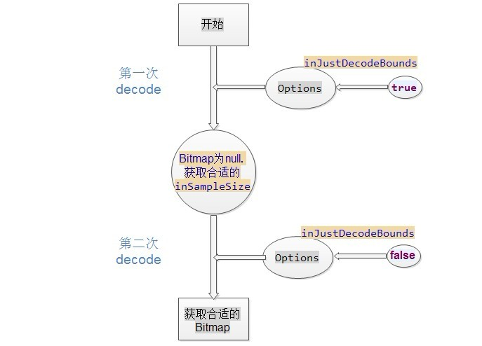

**Bitmap 复用**

如果在 Android 某个页面创建很多个 Bitmap，比如有两张图片 A 和 B，通过点击某一按钮需要在 ImageView 上切换显示这两张图片。但是在每次调用 switchImage 切换图片时，都需要通过 BitmapFactory 创建一个新的 Bitmap 对象。当方法执行完毕后，这个 Bitmap 又会被 GC 回收，这就造成不断地创建和销毁比较大的内存对象，从而导致频繁 GC（或者叫内存抖动）。

如何避免？

每次切换图片只是显示的内容不一样，我们可以重复利用已经占用内存的 Bitmap 空间，具体做法就是使用 Options.inBitmap 参数进行优化。

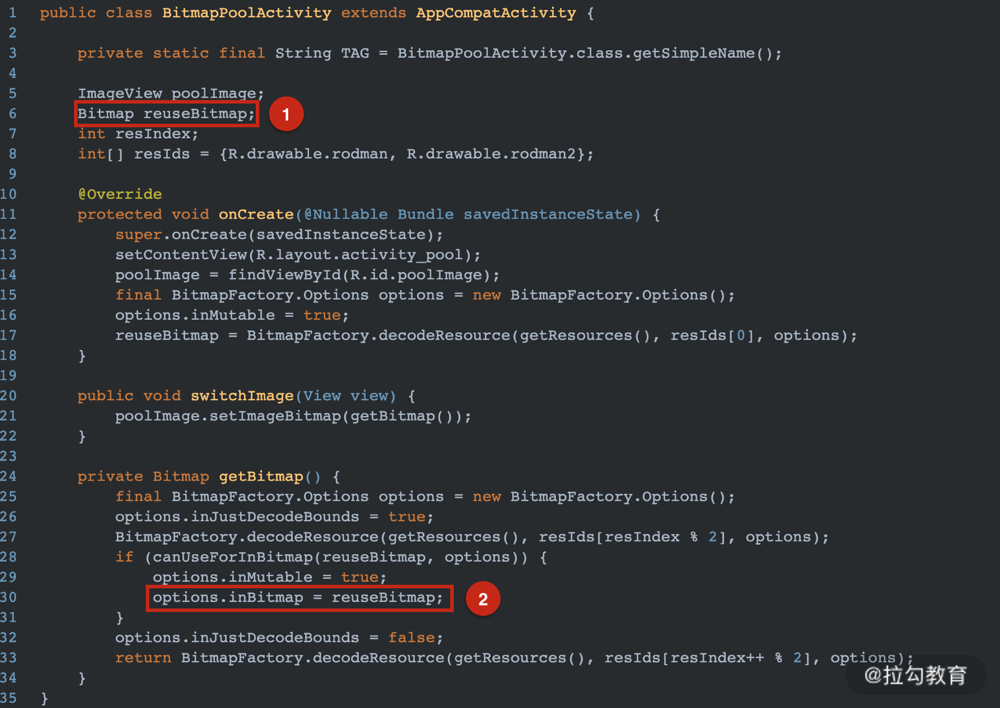

解释说明：

图中 1 处创建一个可以用来复用的 Bitmap 对象。
图中 2 处，将 options.inBitmap 赋值为之前创建的 reuseBitmap 对象，从而避免重新分配内存。

**注意**：在上述 getBitmap 方法中，复用 inBitmap 之前，需要调用 canUseForInBitmap 方法来判断 reuseBitmap 是否可以被复用。这是因为 Bitmap 的复用有一定的限制：

> 在 Android 4.4 版本之前，只能重用相同大小的 Bitmap 内存区域；
> 4.4 之后你可以重用任何 Bitmap 的内存区域，只要这块内存比将要分配内存的 bitmap 大就可以。

**BitmapRegionDecoder 图片分片显示**
有时候我们想要加载显示的图片很大或者很长，比如手机滚动截图功能生成的图片。

针对这种情况，在不压缩图片的前提下，不建议一次性将整张图加载到内存，而是采用分片加载的方式来显示图片部分内容，然后根据手势操作，放大缩小或者移动图片显示区域。

在此基础上，我们可以通过自定义View，添加 touch 事件来动态地设置 Bitmap 需要显示的区域 Rect。具体实现网上已经有很多成熟的轮子可以直接使用，比如 LargeImageView 。张鸿洋先生也有一篇比较详细文章对此介绍：高清加载巨图方案https://blog.csdn.net/lmj623565791/article/details/49300989.

### 七、LRU 算法

https://leetcode-cn.com/problems/lru-cache/solution/lru-ce-lue-xiang-jie-he-shi-xian-by-labuladong/

### 八、事件点击

先讨论两个具体的特殊情况。

子 View 调用了 requestDisallowInterceptTouchEvent(false)， 允许父 ViewGroup 拦截事件。

ViewGroup 的事件分发代码如下：

```java
if (actionMasked == MotionEvent.ACTION_DOWN
                    || mFirstTouchTarget != null) {
                final boolean disallowIntercept = (mGroupFlags & FLAG_DISALLOW_INTERCEPT) != 0;
                if (!disallowIntercept) {
                    intercepted = onInterceptTouchEvent(ev); // (1)允许拦截则走这里
                    ev.setAction(action); // restore action in case it was changed
                } else {
                    intercepted = false;
                }
            } else {
                // There are no touch targets and this action is not an initial down
                // so this view group continues to intercept touches.
                intercepted = true;
            }
// （1）
public boolean onInterceptTouchEvent(MotionEvent ev) {
        if (ev.isFromSource(InputDevice.SOURCE_MOUSE)
                && ev.getAction() == MotionEvent.ACTION_DOWN
                && ev.isButtonPressed(MotionEvent.BUTTON_PRIMARY)
                && isOnScrollbarThumb(ev.getX(), ev.getY())) {
            return true;
        }
        return false;
    }
```

从（1）处可以看到，只有鼠标点击的 DOWN 事件才会被默认拦截掉。如果不复写该方法的话，正常手指 down 不会被拦截。

如果复写该方法，让 DOWN 事件在这里就被拦截的话，那么 mFirstTouchTarget 就一直是 null，不会被赋值。ViewGroup 就是通过 mFirstTouchTarget == null ？ 来判断事件是否传递到了子 View，如果传递到了子 View 且被消费，则不为 null；如果在 down 事件被父 ViewGroup 拦截，或者子 View 都不处理事件，则 mFirstTouchTarget  = null 。

如果是 MOVE 事件被父 View 拦截，那么父 View 会向子 View 发送 CANCEL 事件。

### 九、Rxjava 总结

1、onSubscribe(Disposable d) 方法在建立订阅关系的线程上执行。

2、disposable.dispose() 会：

* 切断上下游关系
* 使上游停止发送事件

3、Retrofit 的 Call 的 Response 转化是在 RxJava2CallAdapater 的 adapt(Call<R> call) 方法中进行转化的，会通过一系列的 bool 值进行判断要转化成哪个类型。

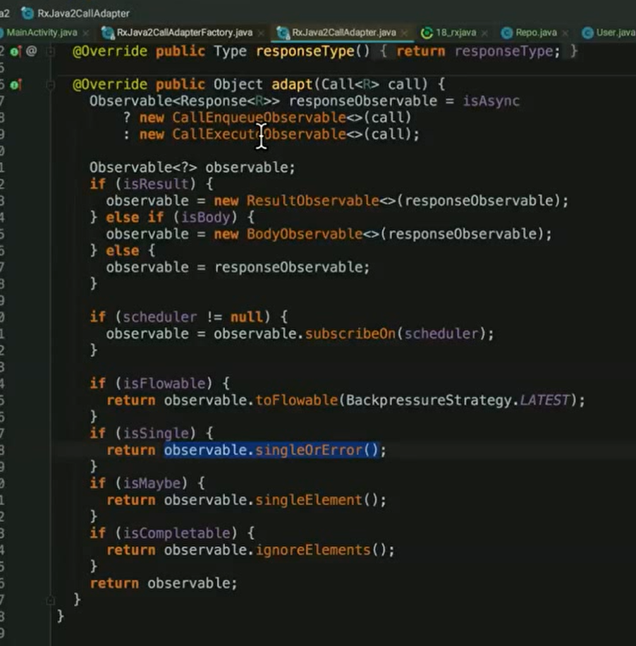

4、Disposable 取消思路

* 中间操作符牵线，上下游对接，下游要取消直接找到上游取消
* 使用 setOnce 和 replace 替换下游 disposable，转化成给上游的 disposable，或者告诉调度器不要再进行下去了

通过继承自 AotmicReference 的 disposable 来达到引用不变而引用指向对象变化的功能。

5、observeOn 在订阅的时候不切线程，而是在事件发射前时候切线程

6、android 几乎用不到背压，跟缓冲相关，buffer 满了就会用背压降低上游发送速率。一般只有在不停地取远端音视频流的情况下才会导致缓冲区满了，需要上游降低速率。

### 十、RecyclerView

RecyclerView 的所谓回收基本原理如下：

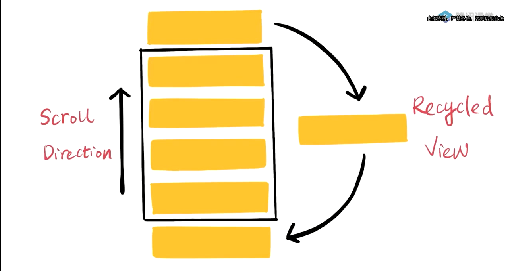

当 item 滑出屏幕不可见的话，就会考虑回收这个 item，而不会始终绘制所有 item。


#### 1、ViewHolder

Tips：findViewById 是 dfs 过程深度优先搜索。

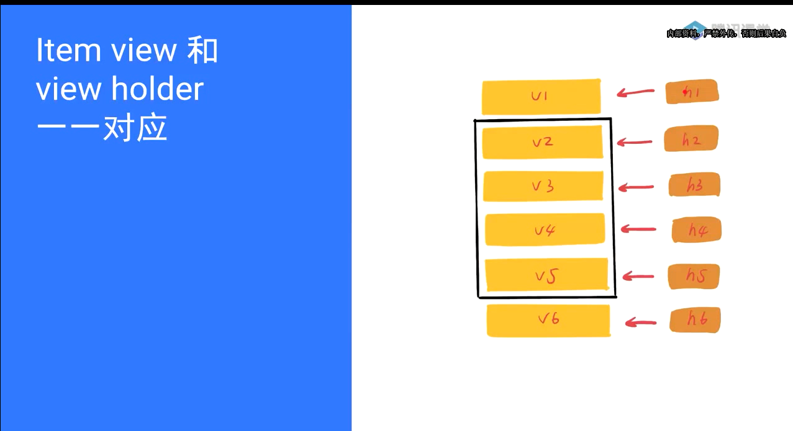

ViewHolder 与 View 是一对一的关系，防止重复调用 findViewById 进行 dfs 过程耗费性能。对于 ListView 来说，ViewHolder 并不是复用 View，因为 convertView 不为空就是在复用 View，ViewHolder 最关键的点在于防止 findViewById 进行 dfs 过程消耗性能。

#### 2、缓存机制

ListView 缓存机制：

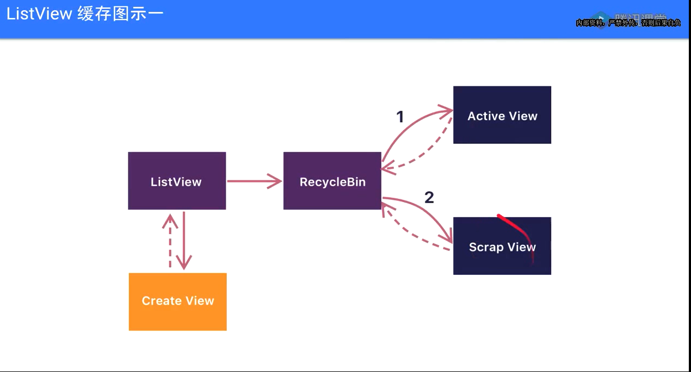

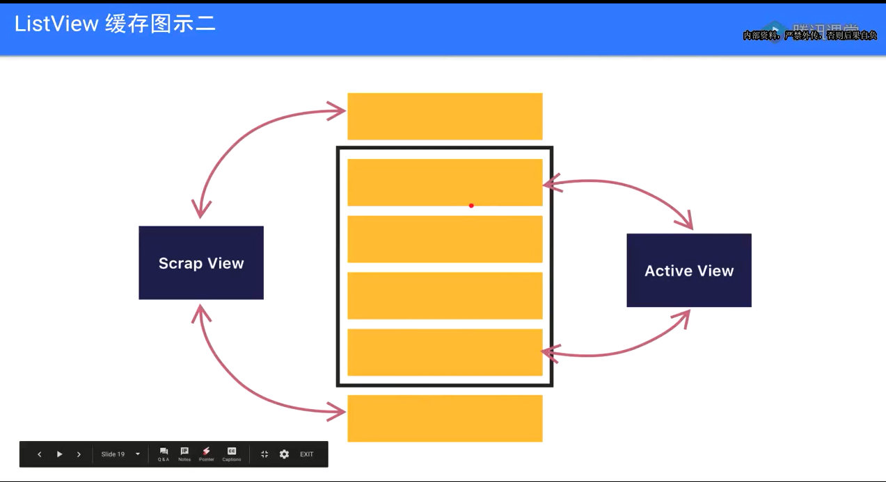

* Active View 是指屏幕上的 View
* Scrap View 是指滑出屏幕外的 View，Scrap View 在复用后要重新绑定数据

RecyclerView 缓存机制：

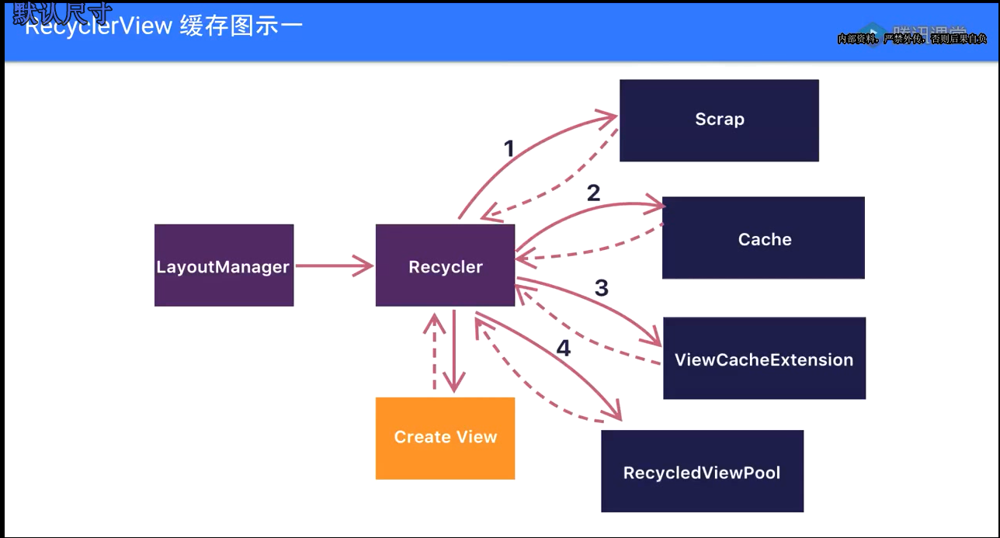

使用 Recycler 来管理缓存，RecyclerView 缓存的是 ViewHolder。

* 第一级缓存 Scrap，指的是屏幕内部的 View

* 第二级缓存 Cache，是指刚刚滑出屏幕外的 View，它和 Scap 一样在复用的时候不用重新绑定数据。通过 position 来在 Scrap 和 Cache 中找到对应的 View 进行复用，不需要重新绑定数据。 Cache 和 Scrap 只关心 Position 不关心 ViewType。

* 第三级缓存 ViewCacheExtension，用户自定义的 cache 策略，用户如果定义了就到这一层查找，没有定义就直接取第四层

* 第四级缓存 RecycledViewPool，RecyclerView 缓存池，所有被废弃的 View 的池子，上面都是 dirty data。使用 ViewType 在 Pool 中找到需要复用的 View ，复用的时候需要重新绑定数据即 onBindViewHolder

* 如果以上缓存都没有，那么调用 Adapter.onCreateViewHolder

* 注意列表广告曝光统计：

  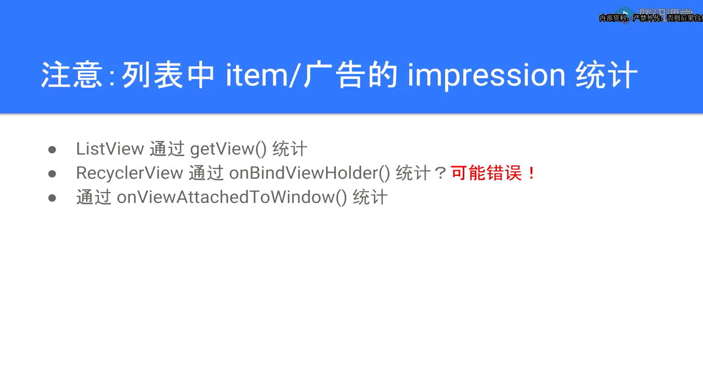

#### 3、RecyclerView 性能优化

* 不要在 onBindViewHolder 设置点击监听，在 onCreateViewHolder 里监听就可以，onBindViewHolder  会被调用多次，容易造成内存抖动

  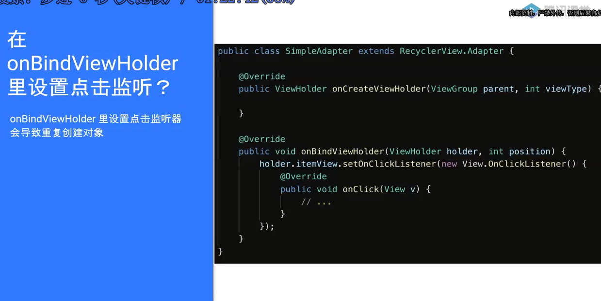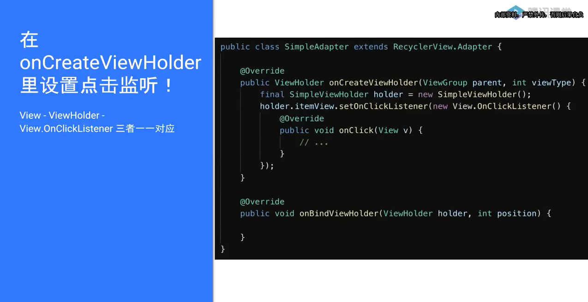

  

* LinearLayoutManager.setInitialPrefetchItemCount()

  


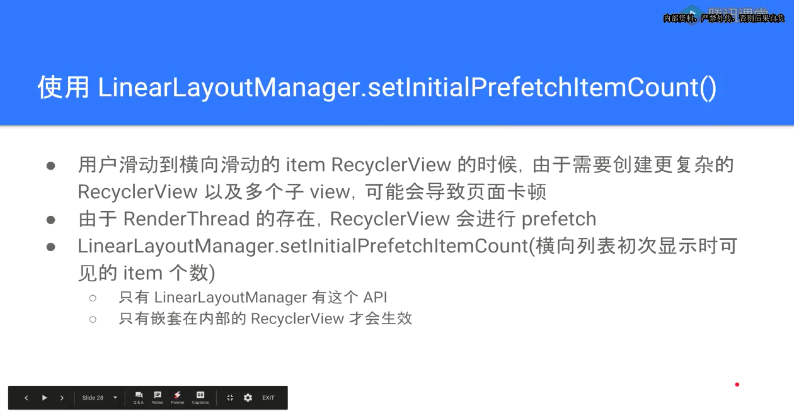

RenderThread 是 Android 5.0 以后添加的专门用于 UI 渲染的线程，减轻了主线程的负担，这样主线程就可以有时间来做 prefetch。对于被嵌套在外部可以滑动的 View 内部作为子 View 的 RecyclerView，比如竖向滑动的 ScrollView 里添加了 横向滑动的 RecyclerView，可以调用 LinearLayoutManager.setInitialPrefetchItemCount() 做 prefetch ，这样 RecyclerView 在被滑动时第一次出现在手机屏幕上出现的时候，这样可以避免第一次匆忙加载 RecyclerView 的 item 而造成卡顿。

* RecyclerView.setHasFixedSize()

  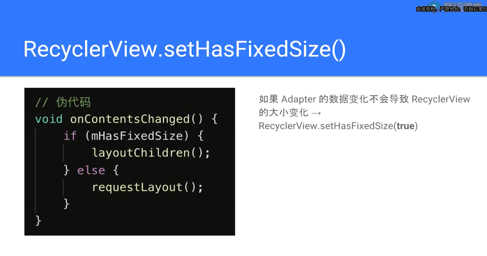

  设置为 true 可以避免整个 RecyclerView 进行一整套 measure、layout、draw 操作。

* 多个 RecyclerView 公用一个 RecycledViewPool

  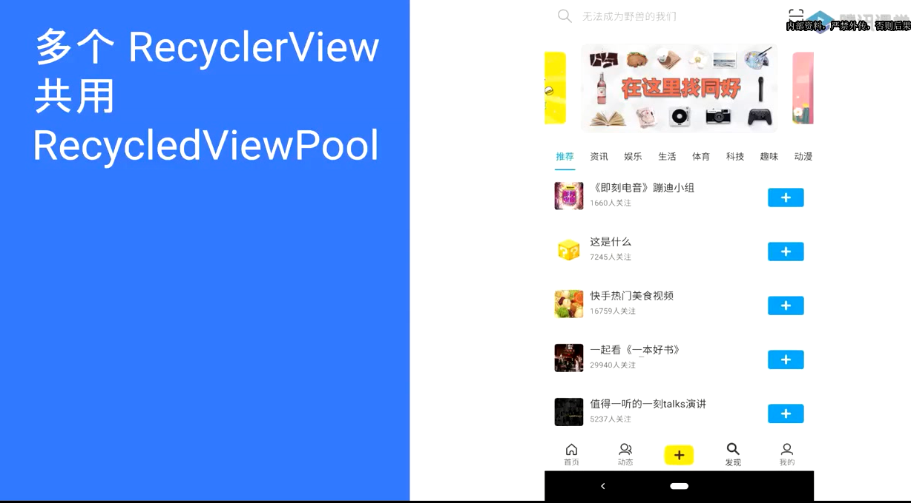

  比如一个 ViewPager 下有好几个 tab，每个 tab 就是一个 RecyclerView，并且它们的 item type 相同，这样就可以让多个 RecyclerView 共用一个 RecycledViewPool。

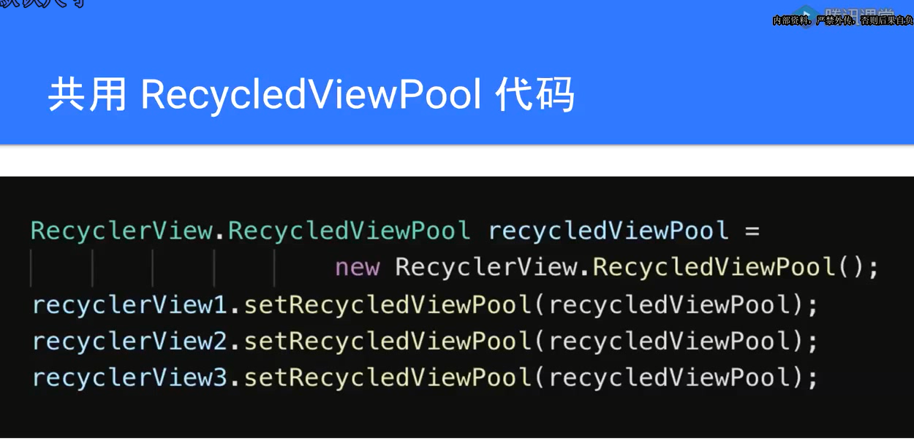

* DiffUtil 提高列表性能

  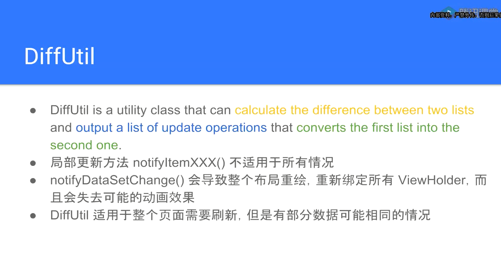

  

  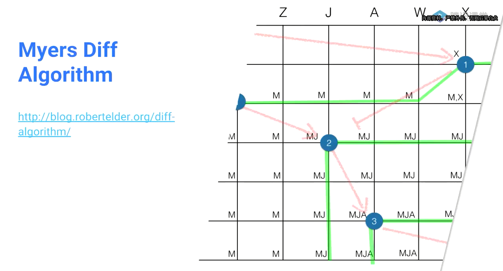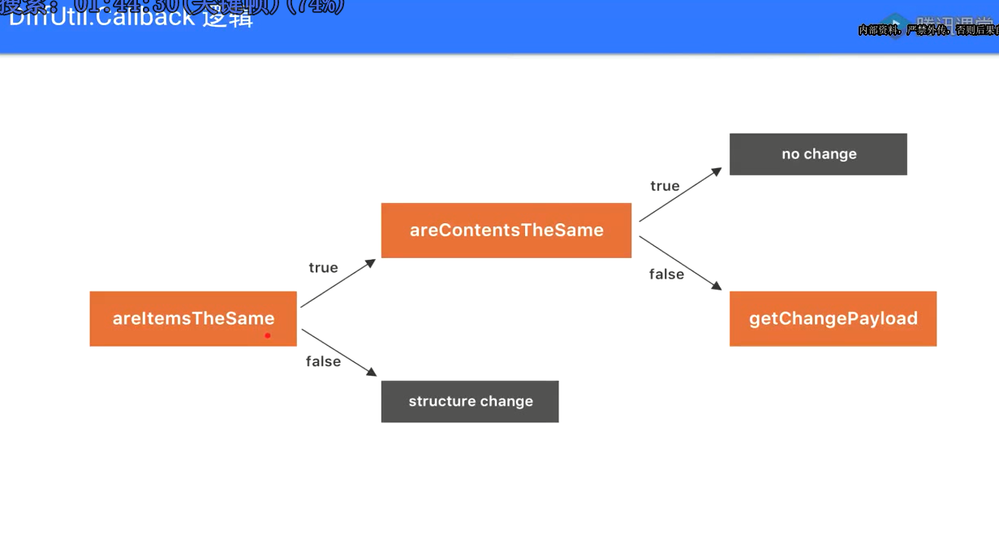

  

  notifyDataSetChange() 会 requestLayout，使整个 RecyclerView 重新测量布局绘制。如果刷新后的列表有部分相同的话，那么使用 DiffUtil 可以提升性能，因为它进行的是增量的更新，而不像 notifyDataSetChange() 是全量的。

  

  如果列表很大，那么计算 diff 会比较耗时，可以放在异步线程做，然后把结果发送回主线程。

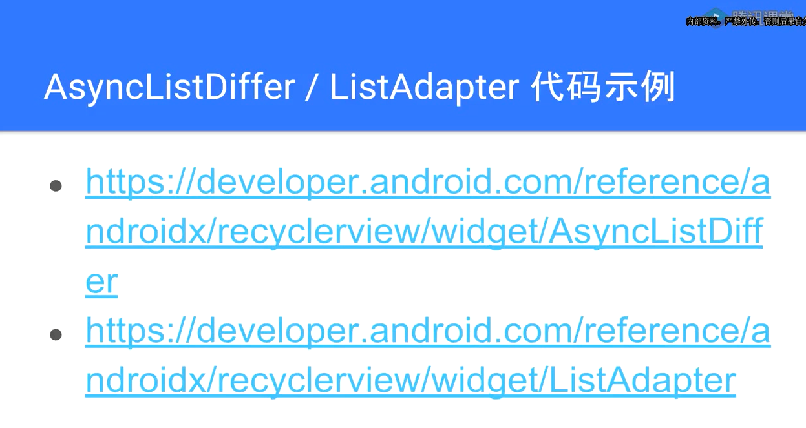

#### 4、ItemDecoration

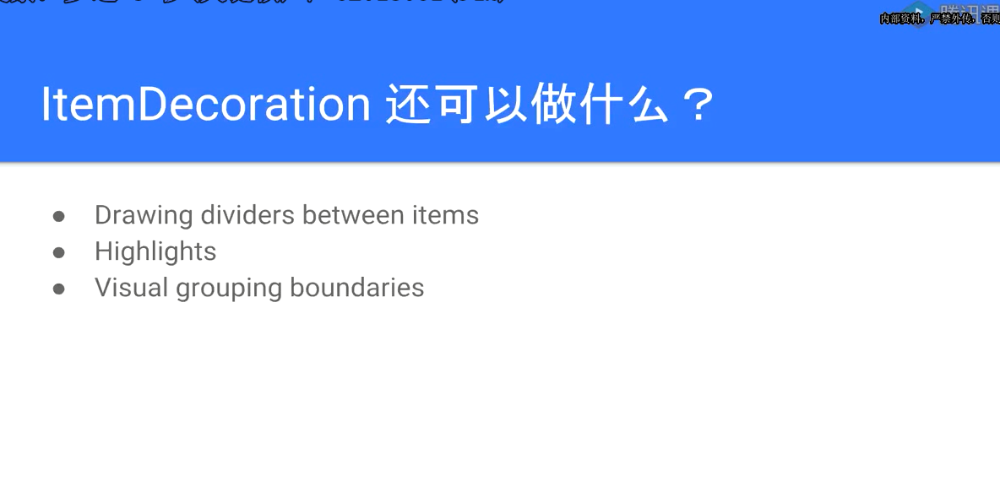

#### 5、进阶

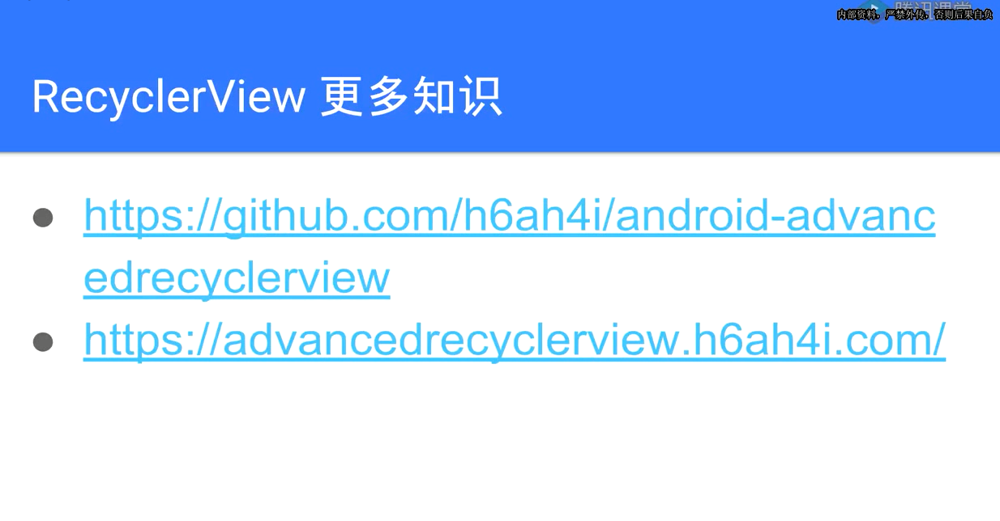

