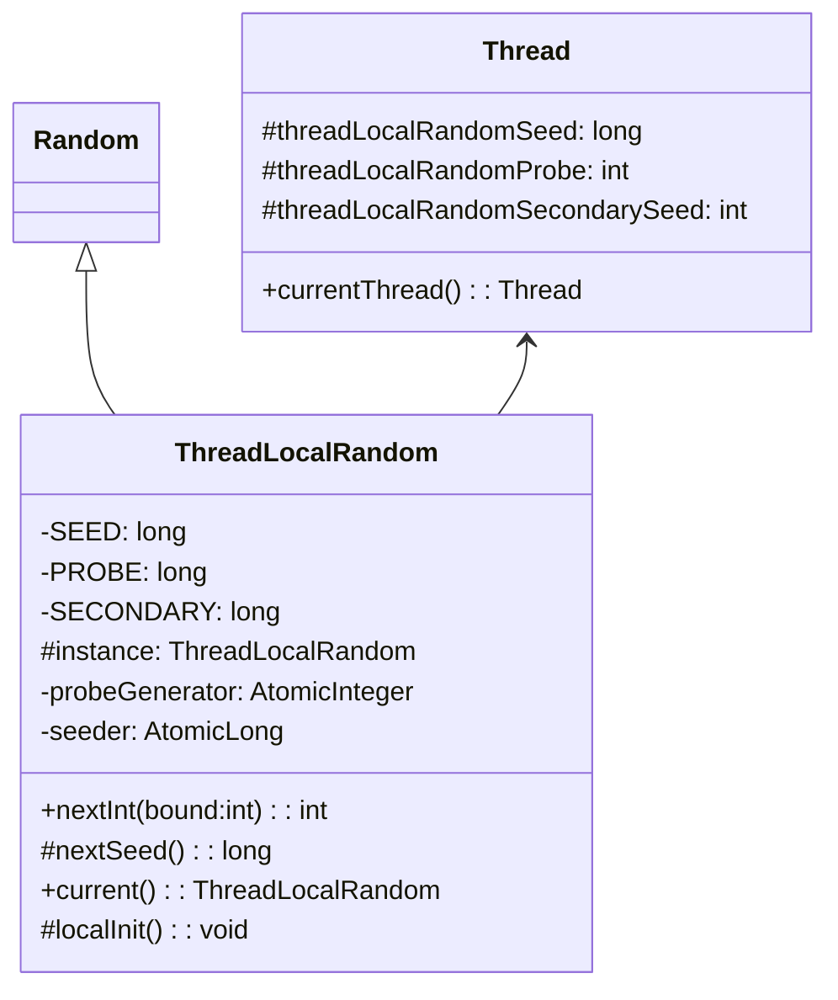
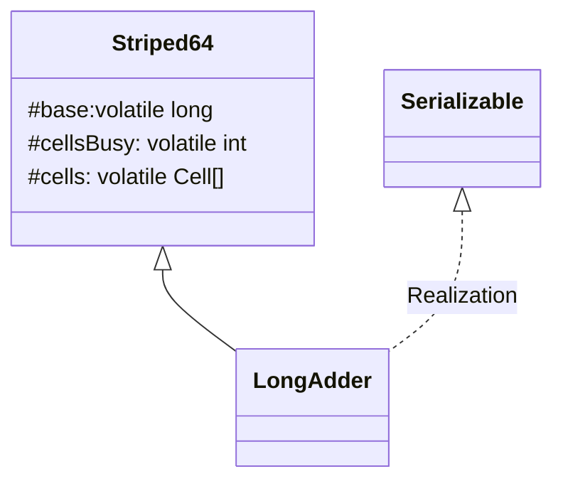
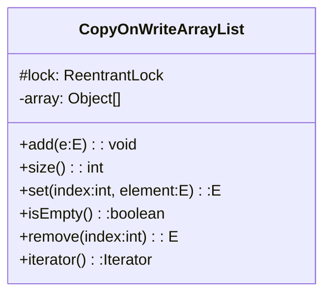

## Java 并发编程总结

#### 进程和线程

#### 线程的状态

#### Thread 相关的各个方法

* thread.sleep

  sleep 在休眠一段时间后自动唤醒，并且休眠时不会释放掉锁

* thread.join

  是对 object.wait 方法的封装，会让调用线程获取到该 thread 对象锁，然后调用 thread.wait 使当前线程阻塞。在 thread 运行结束以后，会在 exit() 中调用 notifyAll() 唤醒调用者线程。

  ```java
  public final synchronized void join(long millis) throws InterruptedException {
          long base = System.currentTimeMillis();
          long now = 0;
          if (millis < 0) {
              throw new IllegalArgumentException("timeout value is negative");
          }
          if (millis == 0) {
              while (isAlive()) {
                  wait(0);
              }
          } else {
              // 这里使用 while 循环 wait 是防止线程被 interrupt，导致提前被唤醒，上面的 while 同理
              while (isAlive()) {
                  long delay = millis - now;
                  if (delay <= 0) {
                      break;
                  }
                  wait(delay);
                  now = System.currentTimeMillis() - base;
              }
          }
      }
  ```

* Thread.yield 静态方法，出让当前线程的时间片使用权，让调度器进行下一轮调度。不会阻塞当前线程。

* object.wait 线程获取到 object 锁，wait 进入阻塞状态，释放掉锁资源

* object.notify 线程获取到 object 锁，通知被 object wait 阻塞的线程，然后释放掉锁资源。具体唤醒哪个线程是随机的，notifyAll 可以唤醒所有因为 wait 被阻塞的线程。

* thread.interrupt 仅仅改变线程地 interrupt 标志位，不会立即停止线程执行。如果线程处于阻塞状态 sleep/join/wait，那么会抛出 InterruptedException

* thread.isInterrupted 是否被中断，不会重置标志位

  ```java
  public boolean isInterrupted() {
     		// false 不重置标志位
          return isInterrupted(false);
      }
  ```

* Thread.inerrupted 调用者线程是否被中断，重置标志位

  ```java
  public static boolean interrupted() {
          return currentThread().isInterrupted(true);
      }
  ```


#### ThreadLocal

ThreadLocal


#### 各种锁的分类

| 锁的分类   | 描述                                                         |
| ---------- | ------------------------------------------------------------ |
| 悲观锁     | 悲观地认为程序并发量很大，很容易产生数据修改冲突。比如 sychronized |
| 乐观锁     | 乐观地认为程序并发量并不大，不容易产生数据冲突，比如 CAS     |
| 公平锁     | 多线程竞争锁时，线程按照顺序排队                             |
| 非公平锁   | 多线程竞争锁时，线程没有顺序                                 |
| 独占锁     | 只能由被单个线程占有，比如 synchronized、ReentrantLock       |
| 共享锁     | 能被多个线程同时占有                                         |
| 可重入锁   | 当该线程获取到锁后，下一个同步语句不需要重新获取这个锁，比如 sychronized |
| 非可重入锁 | 当该线程获取到锁后，下一个同步语句需要重新获取这个锁         |
| 自旋锁     | 线程在竞争获取锁，没有获取到就一直进行循环尝试获取           |


#### synchronized 关键字


#### volatile 关键字


#### CAS  机制

CAS 是一种无锁编程的并发实现。JUC 的 Atomic 包 和 Lock 锁底层均是该机制，1.6 以后 sychronize 关键字在升级为重量级锁之前也是使用 CAS。

CAS 需要三个基本操作数，变量的内存地址 v，旧的预期值 A， 要修改的新值 B，如 JUC Atomic 包中的各种原子类的实现，比如：

```java
 public final boolean compareAndSet(int expect, int update) {
        return unsafe.compareAndSwapInt(this, valueOffset, expect, update); 
     // compareAndSwapInt 是 native 方法
    }
```

旧的期望值加了 volatile 关键字，得到期望值后，在某个线程要更改变量值之前，将期望值和当前值进行比较，如果不相等则更改失败，该线程进入自旋状态，不断循环尝试 CAS 操作，直到操作成功。

##### ABA 问题

某个变量值 A->B->A ，当多个线程同时修改该变量，某个线程阻塞的情况下，可能会出现错误。

加版本号解决 ABA 问题。**AtomicStampedReference** 类实现了版本号的 CAS。

#####  场景

CAS 属于乐观锁，乐观地认为程序地并发量不大，一般不会造成数据修改冲突，适用于并发量不大的业务场景。

#### Unsafe 类

Java 语言不像 C，C++ 那样可以直接访问底层操作系统，但是 JVM 为我们提供了一个后门，这个后门就是unsafe。unsafe 为我们提供了硬件级别的原子操作。Java 中的 **CAS 原子操作的实现就依靠 Unsafe 类**。

上述的 valueOffset 对象，是通过 unsafe.objectFieldOffset 方法得到，所代表的是 AtomicInteger 对象 value 成员变量在内存中的偏移量。我们可以简单地把 valueOffset 理解为 value 变量的内存地址。

Unsafe 类不能直接用 new 创建，构造函数私有。

```java
@CallerSensitive
    public static Unsafe getUnsafe() {
        Class var0 = Reflection.getCallerClass();
        if (!VM.isSystemDomainLoader(var0.getClassLoader())) {
            throw new SecurityException("Unsafe");
        } else {
            return theUnsafe;
        }
    }
```

getUnsafe() 得到的实例，只能被 BootStrapClassLoader 类加载器加载，而不能被 AppClassLoader 加载。所以不能直接在代码中使用 getUnsafe 来获取 Unsafe 实例，但是可以通过**反射**绕过此机制来创建 Unsafe。

**所有在 JAVA_HOME/jre/lib 中的类都会由 BootStrap 来加载**。

#### 伪共享

CPU 中的缓存行大小一般是 2 的幂次方字节数，从主存中加载数据到缓存行中时，是一次加载一整个缓存行的大小。所以缓存行中不只有单个变量而是多个变量。当多个线程同时修改这多个变量时，实际上，某一时刻也只有一个线程能操作缓存行，相比于将多个变量分别放入到不同的缓存行，效率更低。体现了程序运行的**局部性原则**。

##### 如何避免伪共享？

* JDK8 以前通过字节填充来避免伪共享。

  ```java
  public final static class FilledLong {
          public volatile long value = 0L;
          public long p1,p2,p3,p4p5,p6; // 填充
      }
  ```

* JDK8 提供了 sun.misc.Contended 注解

  ```java
  @sun.misc.Contended
  public final static class FilledLong {
  	public volatile long value = 0L;
  }
  ```

  可以修饰类，也可以修饰变量。

  比如 Thread 类中：

  ```java
   /** The current seed for a ThreadLocalRandom */
      @sun.misc.Contended("tlr")
      long threadLocalRandomSeed;
  
      /** Probe hash value; nonzero if threadLocalRandomSeed initialized */
      @sun.misc.Contended("tlr")
      int threadLocalRandomProbe;
  
      /** Secondary seed isolated from public ThreadLocalRandom sequence */
      @sun.misc.Contended("tlr")
      int threadLocalRandomSecondarySeed;
  ```


#### JUC 之 ThreadLocalRandom 

ThreadLocalRandom 是 JDK 7 在 JUC 包下新增的随机数生成器，它弥补了 Random 类在多线程下的缺陷。

Random 类根据种子生成随机数 ，所以在多线程情况下，每个线程有可能获取到相同种子，从而每个线程得到相同的随机数。

Random 类中使用了 AtomicLong 类型的原子性 seed 来避免这种情况，如下：

```java
protected int next(int bits) {
        long oldseed, nextseed;
        AtomicLong seed = this.seed;
        do {
            oldseed = seed.get();
            nextseed = (oldseed * multiplier + addend) & mask;
        } while (!seed.compareAndSet(oldseed, nextseed));
        return (int)(nextseed >>> (48 - bits));
    }
```

但是在并发量很大的情况下，会造成过多线程处于自旋重试状态，降低并发性能，因此有 ThreadLocalRandom 来解决这个问题。



如图所示，ThreadLocalRandom 和 ThreadLocal 类似，本质上都是工具类。ThreadLocalRandom 可以看成一个饿汉式单例。ThreadLocalRandom 的 current() 静态方法如下：

```java
public static ThreadLocalRandom current() {
        if (UNSAFE.getInt(Thread.currentThread(), PROBE) == 0)
            localInit();
        return instance;
    }
```

在 localInit 方法中，初始化当前调用者线程的三个 threadLocalRandom 变量：

```java
static final void localInit() {
        int p = probeGenerator.addAndGet(PROBE_INCREMENT);
        int probe = (p == 0) ? 1 : p; // skip 0
        long seed = mix64(seeder.getAndAdd(SEEDER_INCREMENT));
        Thread t = Thread.currentThread();
        UNSAFE.putLong(t, SEED, seed);
        UNSAFE.putInt(t, PROBE, probe);
    }
```

这里的 probeGenerator 和 seeder 是原子类，因为在多个线程同时初始化的时候，必须保证**每个线程的种子不同**。

再看 nextInt(int bound) 方法：

```java
public int nextInt(int bound) {
        if (bound <= 0)
            throw new IllegalArgumentException(BadBound);
        int r = mix32(nextSeed());
        int m = bound - 1;
        if ((bound & m) == 0) // power of two
            r &= m;
        else { // reject over-represented candidates
            for (int u = r >>> 1;
                 u + m - (r = u % bound) < 0;
                 u = mix32(nextSeed()) >>> 1)
                ;
        }
        return r;
    }

final long nextSeed() {
        Thread t; long r; // read and update per-thread seed
        UNSAFE.putLong(t = Thread.currentThread(), SEED,
                       r = UNSAFE.getLong(t, SEED) + GAMMA);
        return r;
    }
```

这些方法都是与线程无关的通用算法，因为种子是保存在线程内部的，所以这样也是线程安全的。

总而言之，**ThreadLocalRandom 就是帮助每个线程生成不同种子放在各个线程内部，这样线程产生随机数的时候可以互不影响。**

#### JUC 之 Atomic 包

JUC 包中提供了一系列的原子性操作类，都是使用非阻塞的 CAS 算法来实现的。要注意，**CAS 算法只能满足原子性，不能满足可见性和有序性，所以在如 AtomicInteger 等类中，value 是加了 volatile 关键字的，用来满足可见性和有序性。**

以 AtomicLong 为例，

```java
public class AtomicLong extends Number implements java.io.Serializable {
    private static final long serialVersionUID = 1927816293512124184L;
    // 获取 unsafe 实例
    private static final Unsafe unsafe = Unsafe.getUnsafe();
    // 存放值 value 的偏移量
    private static final long valueOffset;
    // 是否 JVM 是否支持 Long 类型无锁 CAS
   	static final boolean VM_SUPPORTS_LONG_CAS = VMSupportsCS8();
    private static native boolean VMSupportsCS8();

    static {
        try {
            // 获取 value 在该类中的属性的偏移量
            valueOffset = unsafe.objectFieldOffset
                (AtomicLong.class.getDeclaredField("value"));
        } catch (Exception ex) { throw new Error(ex); }
    }
    
    // 使用 volatile 关键字保证可见性和有序性
    private volatile long value;

    /**
     * Creates a new AtomicLong with the given initial value.
     *
     * @param initialValue the initial value
     */
    public AtomicLong(long initialValue) {
        value = initialValue;
    }

    /**
     * Creates a new AtomicLong with initial value {@code 0}.
     */
    public AtomicLong() {
    }
    ...
}
```

再看递增操作：

```java
    public final long incrementAndGet() {
        return unsafe.getAndAddLong(this, valueOffset, 1L) + 1L;
    }
```

Unsafe 中：

```java
public final long getAndAddLong(Object var1, long var2, long var4) {
        long var6;
        do {
            var6 = this.getLongVolatile(var1, var2);
        } while(!this.compareAndSwapLong(var1, var2, var6, var6 + var4));// compareAndSwapLong 是 native 方法
        return var6;
    }
```

上面的代码很好懂。

并发量较低的情况下，CAS 优于 synchronized 关键字。但是在并发量高的情况下，由于大量线程的自旋，会导致白白浪费 CPU 资源，因此 JDK 8 新增了一个 LongAdder 类来克服高并发情况下 AtomicLong 的缺点。

##### LongAdder

LongAdder 的基本思想是，既然多个线程同时更新一个原子变量会造成性能浪费，那就让同时让多个线程同时分组，每组更新不同的线程，这样就在一定程度上避免了性能浪费。




cells 就是要更新的数组，大小为 2 的幂次。

cellsBusy 是数组扩容或创建时的自旋锁，只有 0 和 1 两种状态。

先看 Cell 类型：

```java
@sun.misc.Contended static final class Cell {
        volatile long value;
        Cell(long x) { value = x; }
        final boolean cas(long cmp, long val) {
            return UNSAFE.compareAndSwapLong(this, valueOffset, cmp, val);
        }

        // Unsafe mechanics
        private static final sun.misc.Unsafe UNSAFE;
        private static final long valueOffset;
        static {
            try {
                UNSAFE = sun.misc.Unsafe.getUnsafe();
                Class<?> ak = Cell.class;
                valueOffset = UNSAFE.objectFieldOffset
                    (ak.getDeclaredField("value"));
            } catch (Exception e) {
                throw new Error(e);
            }
        }
    }
```

Cell 类型相当于一个精简版的 AtomicLong ，注意它加了 @sun.misc.Contended 注解以解决数组元素伪共享的问题。

重点看 LongAdder 类中的 add 方法：

```java
public void add(long x) {
        Cell[] as; long b, v; int m; Cell a;
        if ((as = cells) != null || !casBase(b = base, b + x)) { // 1
            boolean uncontended = true;
            if (as == null || (m = as.length - 1) < 0 || // 2
                (a = as[getProbe() & m]) == null || // 3
                !(uncontended = a.cas(v = a.value, v + x))) //4
                longAccumulate(x, null, uncontended); // 5
        }
    }
```

+ 代码 1：判断 cells 数组是否为空，如果为空的话，直接 cas 更新 base；如果 cas 操作失败，说明多个线程同时调用 add，那么需要初始化数组，即在 longAccumulate 中初始化。

+ 代码 2,3,4 合起来看，相当于获取当前线程应该访问的那个 cells 数组中的 Cell 元素，然后进行更新。

  as[getProbe & m] 获取到 cells 数组中的那个值，然后代码 4 进行 cas 操作更新这个值。很明显，如果获取到的值是空，那么就需要初始化这个值，意味着数组需要扩容或者初始化；如果 cas 失败的话，意味着多线程竞争更新该值，为了不让线程白白自旋，可要考虑数组的扩容，因此进入 longAccumulate。

看 longAccumulate 方法：

```java
final void longAccumulate(long x, LongBinaryOperator fn,
                              boolean wasUncontended) {
        int h;
        if ((h = getProbe()) == 0) {
            ThreadLocalRandom.current(); // getProbe() 其实就是在获取 ThreadLocalRandom 里面 threadLocalRandomProbe 的值
            h = getProbe();
            wasUncontended = true;
        }
        boolean collide = false;                // True if last slot nonempty
        for (;;) {
            Cell[] as; Cell a; int n; long v;
            if ((as = cells) != null && (n = as.length) > 0) {
                if ((a = as[(n - 1) & h]) == null) {
                    if (cellsBusy == 0) {       //（1） 该线程对应的 cell 为空，数组增加这个 cell
                        Cell r = new Cell(x);    
                        if (cellsBusy == 0 && casCellsBusy()) {
                            boolean created = false;
                            try {               // Recheck under lock
                                Cell[] rs; int m, j;
                                if ((rs = cells) != null &&
                                    (m = rs.length) > 0 &&
                                    rs[j = (m - 1) & h] == null) {
                                    rs[j] = r;
                                    created = true;
                                }
                            } finally {
                                cellsBusy = 0;
                            }
                            if (created)
                                break;
                            continue;           // Slot is now non-empty
                        }
                    }
                    collide = false;
                }
                else if (!wasUncontended)       // CAS already known to fail
                    wasUncontended = true;      // Continue after rehash
                //（2） 当前 cell 存在，进行 cas 操作
                else if (a.cas(v = a.value, ((fn == null) ? v + x :
                                             fn.applyAsLong(v, x))))
                    break;
                else if (n >= NCPU || cells != as) // (3) 元素个数大于 CPU 个数
                    collide = false;            // At max size or stale
                else if (!collide) // (4)
                    collide = true;
                else if (cellsBusy == 0 && casCellsBusy()) { // (5) 元素个数小于 CPU 个数，给数组扩容
                    try {
                        if (cells == as) {      // Expand table unless stale
                            Cell[] rs = new Cell[n << 1];
                            for (int i = 0; i < n; ++i)
                                rs[i] = as[i];
                            cells = rs;
                        }
                    } finally {
                        cellsBusy = 0;
                    }
                    collide = false;
                    continue;                   // Retry with expanded table
                }
                h = advanceProbe(h); // (6) rehash
            }
            // 可以
            else if (cellsBusy == 0 && cells == as && casCellsBusy()) {
                boolean init = false;
                try {                           // Initialize table
                    if (cells == as) {
                        Cell[] rs = new Cell[2];
                        rs[h & 1] = new Cell(x);
                        cells = rs;
                        init = true;
                    }
                } finally {
                    cellsBusy = 0;
                }
                if (init)
                    break;
            }
            else if (casBase(v = base, ((fn == null) ? v + x :
                                        fn.applyAsLong(v, x))))
                break;                          // Fall back on using base
        }
    }
```

cellsBusy 是一个标示，为 0 说明数组没有在初始化或者扩容，也没有新建 Cell 元素，为 1 则相反。

数组初始化很好理解，如果 cells 为空就去初始化，同时 cellsBusy 标示置为 1 ，避免重复初始化。一个线程初始化数组，另一个线程就通过最外层的 for 循环自旋等待。

线程 1 将数组初始化成功了以后，就 break 退出循环，其余线程开始竞争修改变量。

注意，每个线程的 threadLocalRandomProbe 是不一样的，但是 probe & (n - 1) 的结果可能一样，多个线程的情况下更容易发生这个问题。实际上 probe 就是一个 hash 值，这里确定数组下标的方式，类似于 hashmap 。

如果两个线程的 h = probe & (n - 1) 相同，即发生了 hash 碰撞，考虑一下两种情况：

+ 该 h 对应的 Cell 不为空

  不为空，则两者同时竞争修改同一个 cell ，只有一个线程能修改成功，通过代码（2）处的 a.cas 来确保原子性。另外一个线程走到其余分支条件。

  代码 (3) 处，判断数组容量是否大于 CPU 个数，如果大于的话，说明数组容量有富余，不需要扩容，collide 置为 false，然后在代码 (5) 处 rehash，再循环。

  如果数组容量小于 CPU 个数，那么数组容量不够，collide 置为 true，意味着数组需要扩容。但是不立马扩容，而是先 rehash 再尝试修改。如果 rehash 以后仍然 cas 失败，那么就进行数组扩容。

  数组扩容可以把并发修改单个原子变量的性能压力分摊给了多个数组，而不会白白自旋浪费性能。

  由上可知，对于多个线程同时修改同一个 cell ，**先 rehash，再考虑数组扩容**。

+ 该 h 对应的 Cell 为空

  如果 cell 为空，那么先在代码 (1) 处新建 cell，同时将 cellsBusy 置为 1 。接下来的过程与上述相同。

最后，为什么要用 cellsBusy 来标示？因为单纯对变量的 CAS 原子操作作用范围有限，对于数组的结构变化，需要这种方式来保证多线程间的同步。

##### LongAccumulator

LongAdder 是 LongAccumulator 类的一个特例，LongAccumulator 比 LongAdder 更强大。LongAccumulator 可以为累加器提供非 0 的初始值，还可以制定累加规则。比如 LongAccumulator 的 accumulate 函数：

```java
public void accumulate(long x) {
        Cell[] as; long b, v, r; int m; Cell a;
        if ((as = cells) != null ||
            (r = function.applyAsLong(b = base, x)) != b && !casBase(b, r)) {
            boolean uncontended = true;
            if (as == null || (m = as.length - 1) < 0 ||
                (a = as[getProbe() & m]) == null ||
                !(uncontended =
                  (r = function.applyAsLong(v = a.value, x)) == v || // 注意这里
                  a.cas(v, r)))
                longAccumulate(x, function, uncontended);
        }
    }
```

注意处的，`function.applyAsLong(v = a.value, x)` 就是它和 LongAdder 不一样的地方。这个 function 是什么呢？

```java
public class LongAccumulator extends Striped64 implements Serializable {    
	private final LongBinaryOperator function;
    private final long identity; // identitiy 就是可以自定义的初始值
    public LongAccumulator(LongBinaryOperator accumulatorFunction,
                           long identity) {
        this.function = accumulatorFunction;
        base = this.identity = identity;
    }
    ...
}
```

function 是 LongBinaryOperator 类型，如下：

```java
public interface LongBinaryOperator {

    /**
     * Applies this operator to the given operands.
     *
     * @param left the first operand
     * @param right the second operand
     * @return the operator result
     */
    long applyAsLong(long left, long right);
}
```

所以，function 是一个二元运算符对象，applyAsLong 是可以自定义的二元运算符操作。

#### JUC 之 CopyOnWriteArrayList

JUC 中的并发 List 只有 CopyOnWriteArrayList，这是一个线程安全的 ArrayList，对其进行的修改操作都是在底层的一个复制的数组（快照）上进行的，也就是使用了**写时复制**策略。



在 CopyOnWriteArrayList 中，array 数组用来存放具体对象， ReentrantLock 独占锁用来保证同时只有一个线程对 array 进行修改。array 是 volatile 关键字修饰的成员变量。

下面来分析 CopyOnWriteArrayList 中的 add(E e) 函数

```java
public boolean add(E e) {
        final ReentrantLock lock = this.lock;
        lock.lock();//(1)
        try {
            Object[] elements = getArray();
            int len = elements.length;
            Object[] newElements = Arrays.copyOf(elements, len + 1); // (2)
            newElements[len] = e;
            setArray(newElements); // (3)
            return true;
        } finally {
            lock.unlock();
        }
    }
```

首先在（1）处去获取独占锁，只有一个线程会获取到该锁，其余线程阻塞。获取到锁后，代码（2）复制原来的数组并扩容 + 1，然后将新的元素赋值到对应位置，然后（3）处将赋值新的 array 。这里因为加了锁，所以保证了操作的原子性。

再分析 remove(int index) 函数

```java
public E remove(int index) {
        final ReentrantLock lock = this.lock;
        lock.lock();
        try {
            Object[] elements = getArray();
            int len = elements.length;
            E oldValue = get(elements, index);
            int numMoved = len - index - 1;
            if (numMoved == 0)
                setArray(Arrays.copyOf(elements, len - 1));
            else {
                Object[] newElements = new Object[len - 1];
                System.arraycopy(elements, 0, newElements, 0, index);
                System.arraycopy(elements, index + 1, newElements, index,
                                 numMoved);
                setArray(newElements);
            }
            return oldValue;
        } finally {
            lock.unlock();
        }
    }
```

同样，使用 reentrantLock 进行加锁以保证操作的原子性。代码很好懂：

* 如果删除的是最后一个元素，则直接 copy 前 n - 1 个元素组成的数组。
* 如果删除的是中间的元素，那么首先创建一个 len - 1 长度的数组，然后复制 0 到 index-1 的元素到新数组，再赋值 index + 1 之后的元素。

set(int index, E element) 函数也类似，先复制，再修改值，使用 lock 来确保原子性。注意，ArrayList 的 set 函数并没有使用写时复制的策略，而是直接赋值的。

##### 弱一致性问题

关于一致性的解释：

https://en.wikipedia.org/wiki/Weak_consistency 

 https://zhuanlan.zhihu.com/p/67949045

假如线程 A 在修改某个元素的值，在获取到值后，另一个线程 B 删除了其中一个元素，然后线程 A 再进行修改操作，这时线程 A 要修改的 array 已经和 B 删除元素后的 array 不一样了。这就是写时复制策略产生的弱一致性问题。

**set 方法是加锁的，为什么会和其他修改冲突？**

参考 CopyOnWriteArrayList 的迭代器：

```java
 public Iterator<E> iterator() {
        return new COWIterator<E>(getArray(), 0);
    }

static final class COWIterator<E> implements ListIterator<E> {
        /** Snapshot of the array */
        private final Object[] snapshot; // (1)
        /** Index of element to be returned by subsequent call to next.  */
        private int cursor;

        private COWIterator(Object[] elements, int initialCursor) {
            cursor = initialCursor;
            snapshot = elements;
        }

        public boolean hasNext() {
            return cursor < snapshot.length;
        }

        public boolean hasPrevious() {
            return cursor > 0;
        }

        @SuppressWarnings("unchecked")
        public E next() {
            if (! hasNext())
                throw new NoSuchElementException();
            return (E) snapshot[cursor++];
        }

        @SuppressWarnings("unchecked")
        public E previous() {
            if (! hasPrevious())
                throw new NoSuchElementException();
            return (E) snapshot[--cursor];
        }
    	
    /**
         * Not supported. Always throws UnsupportedOperationException.
         * @throws UnsupportedOperationException always; {@code remove}
         *         is not supported by this iterator.
         */
        public void remove() {
            throw new UnsupportedOperationException();
        }

        /**
         * Not supported. Always throws UnsupportedOperationException.
         * @throws UnsupportedOperationException always; {@code set}
         *         is not supported by this iterator.
         */
        public void set(E e) {
            throw new UnsupportedOperationException();
        }

        /**
         * Not supported. Always throws UnsupportedOperationException.
         * @throws UnsupportedOperationException always; {@code add}
         *         is not supported by this iterator.
         */
        public void add(E e) {
            throw new UnsupportedOperationException();
        }
    
        @Override
        public void forEachRemaining(Consumer<? super E> action) {
            Objects.requireNonNull(action);
            Object[] elements = snapshot;
            final int size = elements.length;
            for (int i = cursor; i < size; i++) {
                @SuppressWarnings("unchecked") E e = (E) elements[i];
                action.accept(e);
            }
            cursor = size;
        }
    }

```

代码（1）处，迭代器中指向的 array 就是原 list 中的一个快照。同时迭代器是不允许**增删改**操作的。这样，当迭代器在进行迭代的过程中，有其他线程修改了 array 的话，那么迭代器指向的还是原来的 array ，相当于两个线程在操作不同的数组。

#### JUC 之 LockSupport

LockSupport 是个工具类，它的主要作用是挂起和唤醒线程，是创建锁和其他同步类的基础。LockSupport 使用 Unsafe 实现。LockSupport 与每个使用它的线程都会关联一个许可证，用这个许可证来控制是否阻塞线程。下面介绍几个主要的方法。

* park()

  ```java
  public static void park() {
          UNSAFE.park(false, 0L);
      }
  ```

  线程调用 park() 方法时，如果已经拿到了许可证，则会立即返回；如果没有许可证，则会被阻塞，默认情况下，线程没有许可证。类似 wait 等可以阻塞线程的方法，调用 park 方法最好也使用循环判断方式，防止提前唤醒。需要注意，因为调用 park 方法而被阻塞的线程，在被其他线程调用 thread.interrupt() 中断而返回的时候，并不会抛出 InterruptedException 异常。

  park 方法还支持带有 blocker 参数的方法，如下

  ```java
  public static void park(Object blocker) {
          Thread t = Thread.currentThread();
          setBlocker(t, blocker);
          UNSAFE.park(false, 0L);
          setBlocker(t, null);
      }
  ```

  线程被挂起时，会将这个 blocker 对象记录到线程内部，推荐使用 this 作为 blocker ，这样在使用诊断工具观察线程阻塞的时候，可以知道哪个类被阻塞了。

* unpark(Thread thread)

  ```java
  public static void unpark(Thread thread) {
          if (thread != null)
              UNSAFE.unpark(thread);
      }
  ```

  线程调用 unpark 后，会持有许可证。如果参数中的 thread 之前因为调用 park() 而被挂起，则会 thread 会被唤醒。

  unpark 同样也有支持 blocker 方法。

#### JUC 之 AQS

AQS 即 AbstractQueuedSynchronizer，抽象同步队列，它是实现同步器的基础组件。并发包中的锁的底层就是使用 AQS 实现的。 


AQS 是实现同步器的基础组件，并发包中锁的底层就是 AQS 实现的。AQS 是一个锁的框架，实现了线程锁的大部分功能，可以根据 AQS 来自定义自己的并发锁。可以实现共享锁和非共享锁。

AQS 的关键数据结构是 Node 作为节点的 FIFO 的双向队列。Node 中的 thread 成员变量就是了进入 AQS 队列的 thread。	

使用 AQS 构造的锁有，ReentrantLock、ReentrantReadWriteLock、Semphore、CountDownLatch。在这些锁中，state 代表了不同的含义。对于 AQS 来说，线程同步的关键是对状态值 state 进行操作。根据 state 是否属于一个线程，操作 state 的方式分为独占方式和共享方式。

独占方式获取：

```java
public final void acquire(int arg) {
        if (!tryAcquire(arg) &&
            acquireQueued(addWaiter(Node.EXCLUSIVE), arg))
            selfInterrupt();
    }
```

独占方式释放：

```java
public final boolean release(int arg) {
        if (tryRelease(arg)) {
            Node h = head;
            if (h != null && h.waitStatus != 0)
                unparkSuccessor(h);
            return true;
        }
        return false;
    }
```

共享方式获取：

```java
public final void acquireShared(int arg) {
        if (tryAcquireShared(arg) < 0)
            doAcquireShared(arg);
    }
```

共享方式释放：

```java
public final boolean releaseShared(int arg) {
        if (tryReleaseShared(arg)) {
            doReleaseShared();
            return true;
        }
        return false;
    }
```

如上述代码所示，tryAcquire(int arg)  尝试获取独占资源，tryAcquireShared(arg) 尝试获取共享资源。**注意，tryAcquire(int arg) 和 tryAcquireShared(arg) 并没有在 AQS 中实现，这个方法需要基于 AQS 的锁去自己实现，一般实现是设置 state 的值**。

##### 独占锁

下面主要讨论独占锁相关的内容。以获取独占锁为例，首先 调用 tryAcquire(int arg)  尝试获取锁，如果未获取成功，则调用 addWaiter(Node.EXCLUSIVE) 将该线程包装成独占模式的节点加入到同步队列的队尾。如下代码所示：

```java
private Node addWaiter(Node mode) {
        Node node = new Node(Thread.currentThread(), mode);
        // Try the fast path of enq; backup to full enq on failure
        Node pred = tail;
        if (pred != null) {
            node.prev = pred;
            if (compareAndSetTail(pred, node)) {
                pred.next = node;
                return node;
            }
        }
        enq(node);
        return node;
    }
//enq
private Node enq(final Node node) {
        for (;;) {
            Node t = tail;
            if (t == null) { // Must initialize
                if (compareAndSetHead(new Node())) // （1）
                    tail = head;
            } else {
                node.prev = t;
                if (compareAndSetTail(t, node)) {
                    t.next = node;
                    return t;
                }
            }
        }
    }
private void setHead(Node node) {
        head = node;
        node.thread = null;
        node.prev = null;
    }
```

注意上述代码（1）处这里 new 了一个 node，作为队列的哨兵节点，不是实际上的节点。Node() 无参构造函数如下：

```java
Node() {    // Used to establish initial head or SHARED marker
        }
```

可以看到，该构造函数只用来做 SHARED 的标记或者 head 哨兵头节点。（**为什么会设置一个哨兵节点？**因为第一个获取锁的线程，tryAcquire 直接就获取锁成功了，是不会调用 addWaiter 进入到同步队列中的，同步队列此时还是 null。当后续节点因阻塞进入同步队列时，最初的线程释放锁资源，此时同步队列中的第一个节点实际上是内部 thread 值为 null 的哨兵节点，第二个节点才代表第二个尝试获取锁的线程。这时候队列按 FIFO 的顺序踢出第一个节点，第二个节点前移，内部的线程唤醒。从上面的 setHead 函数可以看出，虽然**头节点的 thread 始终是 null，但是头节点相当于代表现在获取到锁的正在运行的线程**。）

然后调用 acquireQueued(Node node, int arg）尝试获取锁。

```java
final boolean acquireQueued(final Node node, int arg) {
        boolean failed = true;
        try {
            boolean interrupted = false;
            for (;;) {
                final Node p = node.predecessor();
                if (p == head && tryAcquire(arg)) { // （1）
                    setHead(node);
                    p.next = null; // help GC
                    failed = false;
                    return interrupted;
                }
                if (shouldParkAfterFailedAcquire(p, node) &&
                    parkAndCheckInterrupt())
                    interrupted = true;
            }
        } finally {
            if (failed)
                cancelAcquire(node); // (2)
        }
    }
private static boolean shouldParkAfterFailedAcquire(Node pred, Node node) {
        int ws = pred.waitStatus;
        if (ws == Node.SIGNAL)
            /*
             * This node has already set status asking a release
             * to signal it, so it can safely park.
             */
            return true;
        if (ws > 0) {
            /*
             * Predecessor was cancelled. Skip over predecessors and
             * indicate retry.
             */
            do {
                node.prev = pred = pred.prev;
            } while (pred.waitStatus > 0);
            pred.next = node;
        } else {
            /*
             * waitStatus must be 0 or PROPAGATE.  Indicate that we
             * need a signal, but don't park yet.  Caller will need to
             * retry to make sure it cannot acquire before parking.
             */
            compareAndSetWaitStatus(pred, ws, Node.SIGNAL);
        }
        return false;
    }
```

acquireQueued 的流程是这样的：

检查 node 的前一个结点是不是哨兵头节点，如果是的话，则说明该 node 是第一个线程的节点，则 tryAcquire 尝试获取锁，获取成功则将该节点置为头节点。获取失败则进入阻塞判断。

如果 node 是靠后的节点，那么直接进入阻塞判断。从 shouldParkAfterFailedAcquire 可以看到，node 节点的前节点分别是：

* SIGNAL : 

  阻塞 node 的线程

* CANCELLED ：

  从同步队列中删除前节点，并重复此过程，直到前节点的 waitStatus 不为 CANCELLED。

* SHARED 或 PROPAGATE：

  CAS 尝试将前节点的 waitStatus 改为 SIGNAL。如果 CAS 成功的话，那么下一次循环，前节点为 SIGNAL， 就会把 node 的线程阻塞。

再看一下 release 中的 unparkSuccessor(Node node)

```java
private void unparkSuccessor(Node node) {
        /*
         * If status is negative (i.e., possibly needing signal) try
         * to clear in anticipation of signalling.  It is OK if this
         * fails or if status is changed by waiting thread.
         */
        int ws = node.waitStatus;
        if (ws < 0)
            compareAndSetWaitStatus(node, ws, 0);

        /*
         * Thread to unpark is held in successor, which is normally
         * just the next node.  But if cancelled or apparently null,
         * traverse backwards from tail to find the actual
         * non-cancelled successor.
         */
        Node s = node.next;
        if (s == null || s.waitStatus > 0) {
            s = null;
            for (Node t = tail; t != null && t != node; t = t.prev)
                if (t.waitStatus <= 0)
                    s = t;
        }
        if (s != null)
            LockSupport.unpark(s.thread);
    }
```

将头节点的后继节点唤醒，被唤醒的线程又进入到 acquireQueued 的代码（1）处，成为新的头节点，同时后续节点依然被阻塞。

综上所述，整个 AQS 同步队列的机制如下：


当 head 释放，调用 unparkSuccessor 时，2 节点先获取到锁，然后 FIFO 顺序踢出 1 节点，自己变为头节点。上图变为


上图代表的是只有 SIGNAL 的最简单基础的情况。waitStatus 为其余值时，可类似分析。比如被赋值为 CANCELLED 时，同样会调用 unparkSuccessor ，唤醒后续节点，回收当前节点。另外，**从这里可以看出，不论是非公平锁还是公平锁，AQS 自身的同步队列内的阻塞线程始终是按 FIFO 顺序来获取锁的。**

##### 共享锁

共享锁的实现主要由 acquireShared 完成，代码如下：

```java
public final void acquireShared(int arg) {
        if (tryAcquireShared(arg) < 0)
            doAcquireShared(arg);
    }
private void doAcquireShared(int arg) {
        final Node node = addWaiter(Node.SHARED); // 注意这里构造的是 shared mode 的 node
        boolean failed = true;
        try {
            boolean interrupted = false;
            for (;;) {
                final Node p = node.predecessor();
                if (p == head) {
                    int r = tryAcquireShared(arg);
                    if (r >= 0) {
                        setHeadAndPropagate(node, r);
                        p.next = null; // help GC
                        if (interrupted)
                            selfInterrupt();
                        failed = false;
                        return;
                    }
                }
                if (shouldParkAfterFailedAcquire(p, node) &&
                    parkAndCheckInterrupt())
                    interrupted = true;
            }
        } finally {
            if (failed)
                cancelAcquire(node);
        }
    }
```

其中，tryAcquireShared(int arg) 方法由具体的子类实现。如果 tryAcquire 失败，即返回值小于 0 ，则执行 doAcquireShared，线程阻塞。

释放锁代码如下，和独占锁类似，不再赘述：

```java
public final boolean releaseShared(int arg) {
        if (tryReleaseShared(arg)) {
            doReleaseShared();
            return true;
        }
        return false;
    }
private void doReleaseShared() {
        for (;;) {
            Node h = head;
            if (h != null && h != tail) {
                int ws = h.waitStatus;
                if (ws == Node.SIGNAL) {
                    if (!compareAndSetWaitStatus(h, Node.SIGNAL, 0))
                        continue;            // loop to recheck cases
                    unparkSuccessor(h);
                }
                else if (ws == 0 &&
                         !compareAndSetWaitStatus(h, 0, Node.PROPAGATE))
                    continue;                // loop on failed CAS
            }
            if (h == head)                   // loop if head changed
                break;
        }
    }
```

##### ConditionObject


下面再来讨论 ConditionObject 相关的内容。

正如 notify 和 wait 是配合 synchronized 内置锁实现线程间等待唤醒机制一样，条件变量的 signal 和 await 也是用来配合锁实现 AQS 的等待唤醒机制。

#### JUC 之 ReentrantLock

Reentrant Lock 是可重入的独占锁，UML 类图如下：


##### NonfairSync 和 FairSync

NonfairSync 和 FairSync 分别实现了获取锁的非公平策略和公平策略。在 ReentrantLock 的 Sync 类中，AQS 的 state 值代表锁的可重入次数。线程通过 CAS 获取锁，获取成功则 state 加 1，释放锁则 state 减 1。当线程已经获取到一次锁后，第二次获取锁时，state 变为 2。

ReentrantLock 构造函数如下：

```java
public ReentrantLock() {
        sync = new NonfairSync();
    }
public ReentrantLock(boolean fair) {
        sync = fair ? new FairSync() : new NonfairSync();
    }
```

 默认实现的是非公平锁。

lock 方法实现如下，即直接调用 Sync 的 lock 方法：

```java
public void lock() {
        sync.lock();
    }
```

看下非公平锁和公平锁的 lock 方法：

```java
// nonfair lock
final void lock() {
    if (compareAndSetState(0, 1))
        setExclusiveOwnerThread(Thread.currentThread());
    else
        acquire(1);
}
//fair lock
final void lock() {
            acquire(1);
        }
```

可以看到，nonfair lock 会首先尝试 CAS 直接获取锁，获取失败则进入 AQS 的 acqiure 函数。

之前说过，不同的锁需要实现自己的 tryAcquire 函数。接下来看看 nonfair sync 和 fair sync 是怎么实现 tryAcquire 的。

nonfair sync：

```java
protected final boolean tryAcquire(int acquires) {
            return nonfairTryAcquire(acquires);
        }
final boolean nonfairTryAcquire(int acquires) {
            final Thread current = Thread.currentThread();
            int c = getState();
            if (c == 0) {
                if (compareAndSetState(0, acquires)) { 
                    setExclusiveOwnerThread(current);
                    return true;
                }
            }
            else if (current == getExclusiveOwnerThread()) { // (1)
                int nextc = c + acquires; // (2)
                if (nextc < 0) // (3) overflow
                    throw new Error("Maximum lock count exceeded");
                setState(nextc);
                return true;
            }
            return false;
        }
```

代码 (1) 和代码 (2) 处体现了可重入性。如果该线程已经获取了该锁，则将 state 值加 1。代码 (3) 处判断如果 state 小于 0，则表示 state 溢出了。

fair sync :

```java
 protected final boolean tryAcquire(int acquires) {
            final Thread current = Thread.currentThread();
            int c = getState();
            if (c == 0) {
                if (!hasQueuedPredecessors() && // （1）公平性策略
                    compareAndSetState(0, acquires)) {
                    setExclusiveOwnerThread(current);
                    return true;
                }
            }
            else if (current == getExclusiveOwnerThread()) {
                int nextc = c + acquires;
                if (nextc < 0)
                    throw new Error("Maximum lock count exceeded");
                setState(nextc);
                return true;
            }
            return false;
        }
public final boolean hasQueuedPredecessors() {
        // The correctness of this depends on head being initialized
        // before tail and on head.next being accurate if the current
        // thread is first in queue.
        Node t = tail; // Read fields in reverse initialization order
        Node h = head;
        Node s;
        return h != t &&
            ((s = h.next) == null || s.thread != Thread.currentThread());
    }
```

公平锁仅在代码（1）处与非公平锁不同，这里就是体现公平的地方。在锁资源被释放掉以后，AQS 同步队列中的线程和外来线程同时竞争锁，hasQueuedPredecessors() 用于判断 AQS 的同步队列中是否含有已经在等待锁的线程。如果有的话，同步队列以外的线程则会竞争锁失败，而队列中等待线程优先竞争锁。非公平锁则相反，同步队列以外的线程可以同等地和队列中地线程竞争。

上述代码中的判断：

* h == t，说明当前队列为空，直接返回 false
* h != t，并且 s == null，则说明有一个元素将要作为 AQS 的第一个节点入队（回顾前面的内容，addWaiter 调用过程中，enq 函数的第一个元素入队列是两部操作：首先创建一个哨兵节点，然后将第一个节点插入到哨兵节点后面，而此时尚未进入到 acquireQueued 中），那么返回 true
* h != t，s != null，且 s.thread != Thread.currentThread() 则说明队列里正有线程要竞争锁，且不是当前线程，故返回 true

##### 其余方法

下面在介绍几个方法：

1、lockInterruptibly() 

```java
public void lockInterruptibly() throws InterruptedException {
        sync.acquireInterruptibly(1);
    }

// AQS
public final void acquireInterruptibly(int arg)
            throws InterruptedException {
        if (Thread.interrupted())
            throw new InterruptedException();// 当前线程中断则直接抛出异常
        if (!tryAcquire(arg))
            doAcquireInterruptibly(arg);
    }
```

与 lock() 方法类似，对中断响应，抛出异常。

2、tryLock()  和 tryLock(long timeout, TimeUnit unit)

```java
public boolean tryLock() {
        return sync.nonfairTryAcquire(1);
    }

public boolean tryLock(long timeout, TimeUnit unit)
            throws InterruptedException {
        return sync.tryAcquireNanos(1, unit.toNanos(timeout));
    }

//AQS
public final boolean tryAcquireNanos(int arg, long nanosTimeout)
            throws InterruptedException {
        if (Thread.interrupted())
            throw new InterruptedException();
        return tryAcquire(arg) ||
            doAcquireNanos(arg, nanosTimeout);
    }

private boolean doAcquireNanos(int arg, long nanosTimeout)
            throws InterruptedException {
        if (nanosTimeout <= 0L)
            return false;
        final long deadline = System.nanoTime() + nanosTimeout;
        final Node node = addWaiter(Node.EXCLUSIVE);
        boolean failed = true;
        try {
            for (;;) {
                final Node p = node.predecessor();
                if (p == head && tryAcquire(arg)) {
                    setHead(node);
                    p.next = null; // help GC
                    failed = false;
                    return true;
                }
                nanosTimeout = deadline - System.nanoTime();
                if (nanosTimeout <= 0L)
                    return false;
                if (shouldParkAfterFailedAcquire(p, node) &&
                    nanosTimeout > spinForTimeoutThreshold)
                    LockSupport.parkNanos(this, nanosTimeout);
                if (Thread.interrupted())
                    throw new InterruptedException();
            }
        } finally {
            if (failed)
                cancelAcquire(node);
        }
    }
```

tryLock() 只是竞争锁，不会导致线程被阻塞。tryLock(long timeout, TimeUnit unit) 则给竞争锁设定了时间，若超时未获取到锁则返回 false，获取到锁则线程继续运行。tryLock(long timeout, TimeUnit unit) 在设定时间内可以导致线程阻塞，进入同步队列。从 doAquireNanos(int arg, long nanosTimeout) 的源码可以看到，是通过 LockSupport.parkNanos(Object locker, long nanosTimeout) 来进行定时阻塞的。

3、unlock() 

```java
public void unlock() {
        sync.release(1);
    }

// AQS
public final boolean release(int arg) {
        if (tryRelease(arg)) {
            Node h = head;
            if (h != null && h.waitStatus != 0)
                unparkSuccessor(h);
            return true;
        }
        return false;
    }

// Sync
protected final boolean tryRelease(int releases) {
            int c = getState() - releases;
            if (Thread.currentThread() != getExclusiveOwnerThread())
                throw new IllegalMonitorStateException();
            boolean free = false;
            if (c == 0) {
                free = true;
                setExclusiveOwnerThread(null);
            }
            setState(c);
            return free;
        }
```

release 相关的代码很好懂，释放锁，state -1 ，所以对于可重入锁来说，重入几次就要释放几次。

#### JUC 之 ReentrantReadWriteLock

ReentrantLock 是独占锁，但是实际场景中会存在读多写少的情况，使用独占锁则会造成性能浪费。于是有了 ReentrantReadWriteLock。ReentrantReadWriteLock 采用读写分离的策略，每个线程都可以同时获得读锁。


读写锁内部维护了一个 ReadLock 和一个 WriteLock，它们依赖 Sync 实现具体功能。同样读写锁也提供了公平和非公平的实现，下面只介绍非公平实现。

读写锁的读锁是共享锁，而写锁是可重入独占锁。对于 AQS 的 state 的值，高 16 位代表线程获取到读锁的次数，低 16 位表示写锁的可重入次数。这些代码都在 Sync 类中实现。和这里的实现机制有关的代码如下：

```java
		// 16位位移
		static final int SHARED_SHIFT   = 16;
        // 读锁状态单位值65536
		static final int SHARED_UNIT    = (1 << SHARED_SHIFT);
		// 读锁最大共享线程数
		static final int MAX_COUNT      = (1 << SHARED_SHIFT) - 1;
		// 写锁掩码
		static final int EXCLUSIVE_MASK = (1 << SHARED_SHIFT) - 1;

        /** Returns the number of shared holds represented in count  */
        static int sharedCount(int c)    { return c >>> SHARED_SHIFT; }
        /** Returns the number of exclusive holds represented in count  */
        static int exclusiveCount(int c) { return c & EXCLUSIVE_MASK; }
		
		// 每个线程的读锁可重入次数
		static final class HoldCounter {
            int count = 0;
            // Use id, not reference, to avoid garbage retention
            final long tid = getThreadId(Thread.currentThreaad());
        }
		
		// 当前线程获取到的重入读锁次数，threadLocal 类型
		private transient ThreadLocalHoldCounter readHolds;
		// 最后一个获取读锁线程的重入次数
		private transient HoldCounter cachedHoldCounter;
		
		// 第一个获取到读锁的线程
		private transient Thread firstReader = null;
		// 第一个获取到读锁的线程的读锁重入次数
        private transient int firstReaderHoldCount;
```

首先看看读写锁的构造方法：

```java
public ReentrantReadWriteLock() {
        this(false);
    }
public ReentrantReadWriteLock(boolean fair) {
        sync = fair ? new FairSync() : new NonfairSync();
        readerLock = new ReadLock(this);
        writerLock = new WriteLock(this);
    }
protected ReadLock(ReentrantReadWriteLock lock) {
            sync = lock.sync;
        }
protected WriteLock(ReentrantReadWriteLock lock) {
            sync = lock.sync;
        }
```

可以看到，默认是非公平锁。并且读锁和写锁均由 ReentrantReadWriteLock 的全局变量 sync 传入进行构造。 

##### 写锁

写锁的具体逻辑由 Sync 类实现，与 ReentrantLock 类似，看看 Sync 类中 tryAcquire(int args) 的实现：

```java
protected final boolean tryAcquire(int acquires) {
            Thread current = Thread.currentThread();
            int c = getState();
            int w = exclusiveCount(c); // 写锁的可重入次数
            if (c != 0) {
                // (Note: if c != 0 and w == 0 then shared count != 0)
                if (w == 0 || current != getExclusiveOwnerThread()) // (1)
                    return false;
                if (w + exclusiveCount(acquires) > MAX_COUNT)
                    throw new Error("Maximum lock count exceeded");
                // Reentrant acquire
                setState(c + acquires); // (2)
                return true;
            }
            if (writerShouldBlock() || !compareAndSetState(c, c + acquires)) //（3）
                return false;
            setExclusiveOwnerThread(current);
            return true;
        }
// nonfair
final boolean writerShouldBlock() {
            return false; // writers can always barge
        }
// fair
final boolean writerShouldBlock() {
            return hasQueuedPredecessors();
        }
```

代码 (1) 处，如果 c != 0 && w == 0，说明没有写锁，但是有读锁，故不能竞争到写锁；如果有写锁，但是持有写锁的线程不为当前线程，则同样无法竞争到锁，因为写锁为独占锁。

代码 (2) 处，如果竞争成功，则更改 state 的值，低16 位加 1。

如果 c == 0，进入到代码 (3) 处。c == 0 说明读写锁均没有被获取。非公平锁一定返回 false，根据后续 CAS 更改 state 的值判断是否需要阻塞当前线程。而公平锁则取决于是否有在同步队列中等待的 node。如果有的话，则返回 true。

再查看写锁的 unlock 过程，很好懂，不赘述：

```java
public void unlock() {
            sync.release(1);
        }
protected final boolean tryRelease(int releases) {
            if (!isHeldExclusively())
                throw new IllegalMonitorStateException();
            int nextc = getState() - releases; // 获取写锁的可重入值，这里没有考虑高 16 位因为获取到写锁时，读锁状态值肯定为0
            boolean free = exclusiveCount(nextc) == 0;
            if (free)
                setExclusiveOwnerThread(null);
            setState(nextc);
            return free;
        }
```

其他函数如 lockInterruptibly()、tryLock()、tryLock(long timeout, TimeUnit unit) 等也很好理解，和 ReentrantLock 中类似，不再赘述。

##### 读锁

读锁是共享锁，分析其中的 tryAcquireShared 代码：

```java
protected final int tryAcquireShared(int unused) {
            Thread current = Thread.currentThread();
            int c = getState();
            if (exclusiveCount(c) != 0 &&
                getExclusiveOwnerThread() != current)
                return -1;
            int r = sharedCount(c);
            if (!readerShouldBlock() && // (1)
                r < MAX_COUNT &&
                compareAndSetState(c, c + SHARED_UNIT)) {
                if (r == 0) {
                    firstReader = current;
                    firstReaderHoldCount = 1;
                } else if (firstReader == current) {
                    firstReaderHoldCount++;
                } else {
                    HoldCounter rh = cachedHoldCounter;
                    if (rh == null || rh.tid != getThreadId(current))
                        cachedHoldCounter = rh = readHolds.get();
                    else if (rh.count == 0) // ？这里是什么意思？
                        readHolds.set(rh);
                    rh.count++;
                }
                return 1;
            }
            return fullTryAcquireShared(current); // 类似于 tryAcquireShared,但是是自旋获取
        }

final int fullTryAcquireShared(Thread current) {
            HoldCounter rh = null;
            for (;;) {
                int c = getState();
                if (exclusiveCount(c) != 0) {
                    if (getExclusiveOwnerThread() != current)
                        return -1;
                    // else we hold the exclusive lock; blocking here
                    // would cause deadlock.
                } else if (readerShouldBlock()) { //(2) 注意这里可以导致读线程阻塞
                    // Make sure we're not acquiring read lock reentrantly
                    if (firstReader == current) {
                        // assert firstReaderHoldCount > 0;
                    } else {
                        if (rh == null) {
                            rh = cachedHoldCounter;
                            if (rh == null || rh.tid != getThreadId(current)) {
                                rh = readHolds.get();
                                if (rh.count == 0)
                                    readHolds.remove();
                            }
                        }
                        if (rh.count == 0)
                            return -1;
                    }
                }
                if (sharedCount(c) == MAX_COUNT)
                    throw new Error("Maximum lock count exceeded");
                if (compareAndSetState(c, c + SHARED_UNIT)) {
                    if (sharedCount(c) == 0) {
                        firstReader = current;
                        firstReaderHoldCount = 1;
                    } else if (firstReader == current) {
                        firstReaderHoldCount++;
                    } else {
                        if (rh == null)
                            rh = cachedHoldCounter;
                        if (rh == null || rh.tid != getThreadId(current))
                            rh = readHolds.get();
                        else if (rh.count == 0)
                            readHolds.set(rh);
                        rh.count++;
                        cachedHoldCounter = rh; // cache for release
                    }
                    return 1;
                }
            }
        }
```

可以看到，没有写线程持有锁时，在判断是否需要阻塞时，与 state 相关的只有 r < MAX_COUNT 的约束，即意味着在上限内读线程有多少来多少，都可以获取到锁，不会阻塞。即使暂时无法获取到锁，也会进入 fullTryAcquireShared 的自旋尝试获取读锁，除 readerShouldBlock() 返回 true 的情况外都不会阻塞。

代码 (1) 和 (2) 处的 readerShouldBlock() 函数用以判断当前线程是否需要阻塞。其实现如下：

```java
// fair sync
final boolean readerShouldBlock() {
            return hasQueuedPredecessors();
        }
// non fair sync
final boolean readerShouldBlock() {
            /* As a heuristic to avoid indefinite writer starvation,
             * block if the thread that momentarily appears to be head
             * of queue, if one exists, is a waiting writer.  This is
             * only a probabilistic effect since a new reader will not
             * block if there is a waiting writer behind other enabled
             * readers that have not yet drained from the queue.
             */
            return apparentlyFirstQueuedIsExclusive();
        }
final boolean apparentlyFirstQueuedIsExclusive() {
        Node h, s;
        return (h = head) != null &&
            (s = h.next)  != null &&
            !s.isShared()         && //(1)
            s.thread != null;
    }
```

注意，再非公平实现中，并没有像写锁那样直接返回 false，而是调用了 apparentlyFirstQueuedIsExclusive 来判断 AQS 同步队列中正在等待的第一个节点，即第二个节点是不是写锁，上述代码 (1) 处。如果是写锁，则 readerShouldBlock 返回 true。**为什么要这样？**因为如果直接返回 false 的话，再读多写少的情况下，由可能会出现在等待写锁的第一个节点一直无法得到锁的情况，一直阻塞。为了避免这种情况，所以要判断一下下一个节点是不是在尝试获取写锁。当然，这只是在一定程度上缓解了写线程饥饿的情况。如果第一个等待节点在等待读锁，下一个才是写锁，那同样可能造成写线程饥饿。

再看 unlock 函数：

```java
public void unlock() {
            sync.releaseShared(1);
        }
protected final boolean tryReleaseShared(int unused) {
            Thread current = Thread.currentThread();
            if (firstReader == current) {
                // assert firstReaderHoldCount > 0;
                if (firstReaderHoldCount == 1)
                    firstReader = null;
                else
                    firstReaderHoldCount--;
            } else {
                HoldCounter rh = cachedHoldCounter;
                if (rh == null || rh.tid != getThreadId(current))
                    rh = readHolds.get();
                int count = rh.count;
                if (count <= 1) {
                    readHolds.remove();
                    if (count <= 0)
                        throw unmatchedUnlockException();
                }
                --rh.count;
            }
            for (;;) { //循环直到读锁计数 - 1 CAS 操作成功
                int c = getState();
                int nextc = c - SHARED_UNIT;
                if (compareAndSetState(c, nextc))
                    // Releasing the read lock has no effect on readers,
                    // but it may allow waiting writers to proceed if
                    // both read and write locks are now free.
                    return nextc == 0;
            }
        }

```

其他函数如 lockInterruptibly()、tryLock()、tryLock(long timeout, TimeUnit unit) 等也很好理解，和 ReentrantLock 中类似，不再赘述。

#### JUC 之 StampedLock

// 待补充

#### JUC 之并发队列

JDK 中提供了一系列并发安全队列，按照实现方式不同可分为阻塞队列和非阻塞队列。前者用锁实现，后者则用 CAS 算法实现。

#### JUC 并发队列之 ConcurrentLinkedQueue

ConcurrentLinkedQueue  是无界队列。

ConcurrentLinkedQueue 类结构如下：


ConcurrentLinkedQueue 内部的数据结构就是一个以 Node 为节点的单链表。其中有两个 volatile 修饰的 head 和 tail 分别指向链表的头尾节点。队列生成时，头尾是的 node 内部的 E 为 null 的哨兵节点。

```java
private transient volatile Node<E> head;
private transient volatile Node<E> tail;
// 构造函数
public ConcurrentLinkedQueue() {
        head = tail = new Node<E>(null);
    }
```

##### offer 操作

```java
public boolean offer(E e) {
        checkNotNull(e);
        final Node<E> newNode = new Node<E>(e);

        for (Node<E> t = tail, p = t;;) {
            Node<E> q = p.next;
            if (q == null) {
                // p is last node
                if (p.casNext(null, newNode)) {
                    // Successful CAS is the linearization point
                    // for e to become an element of this queue,
                    // and for newNode to become "live".
                    if (p != t) // hop two nodes at a time
                        casTail(t, newNode);  // Failure is OK.
                    return true;
                }
                // Lost CAS race to another thread; re-read next
            }
            else if (p == q)
                // We have fallen off list.  If tail is unchanged, it
                // will also be off-list, in which case we need to
                // jump to head, from which all live nodes are always
                // reachable.  Else the new tail is a better bet.
                p = (t != (t = tail)) ? t : head;
            else
                // Check for tail updates after two hops.
                p = (p != t && t != (t = tail)) ? t : q;
        }
    }
```


// 待补充

#### JUC 并发队列之 LinkedBlockingQueue

LinkedBlockingQueue 是有界队列，可以在创建对象时指定 capacity，不指定则默认为 Integer.MAX_VALUE。因为队列有界，所以含有生产者消费者模型。

offer 和 poll 方法会判断当前队列满还是空，再进行操作，所以不会有条件阻塞。而 put 和 take 操作则会因为队列满和空而调用 notFull.await() 和 notEmpty.await() 进入条件阻塞。

// 待补充

#### JUC 并发队列之 ArrayBlockingQueue

ArrayBlockingQueue 中只有一个由 ReentrantLock 实现的 lock，故不能同时 poll 和 offer。lock 默认是非公平锁。锁的粒度较大。

// 待补充

#### JUC 并发队列之 PriorityBlockingQueue

PriorityBlockingQueue 是待优先级的无界阻塞队列，每次出队都返回优先级最高或者最低的对象。其内部是使用平衡二叉树堆实现的，所以直接遍历队列元素不保证有序。

每次 offer 操作和 poll 操作完成以后，都会将最小的元素换到根顶，形成小顶堆。这样每次取元素的时候都是取的最小元素。

// 待补充

#### JUC 并发队列之 DelayQueue

DelayQueue 内部是由 PriorityBlockingQueue 实现的。delay 的时间就是优先级。take 方法取出队首 delay 时间最短的元素，当其 delay 时间还未走完时，调用 awaitNanos(long delay) 进入限时阻塞，同时释放锁。

另外，DelayQueue 取元素时遵循 leader-follower 模式，因为取元素时线程 A 可能因进入限时阻塞而释放锁，这时候会可能有线程 B 来取相同的元素，而当线程 A 阻塞超时返回时，可能会导致 A 和 B 同时取一个元素，这时候导致出错。所以有 leader-follower 模式：线程 A 取队首元素时，若没有其他线程也在取，则它设为 leader。如果有其他线程正在取，则设为 follower。

// 待补充

#### JUC 之线程池

https://tech.meituan.com/2020/04/02/java-pooling-pratice-in-meituan.html

Java中的线程池核心实现类是ThreadPoolExecutor，其设计思想把任务提交和任务执行解耦，类图如下：


用户无需关注如何创建线程，如何调度线程来执行任务，用户只需提供 Runnable 对象，将任务的运行逻辑提交到执行器(Executor)中，由 Executor 框架完成线程的调配和任务的执行部分。

线程调度如下：


#### JUC 之 CountDownLatch

// 待补充

#### JUC 之 CyclicBarrier

// 待补充

#### JUC 之 Semaphore

// 待补充