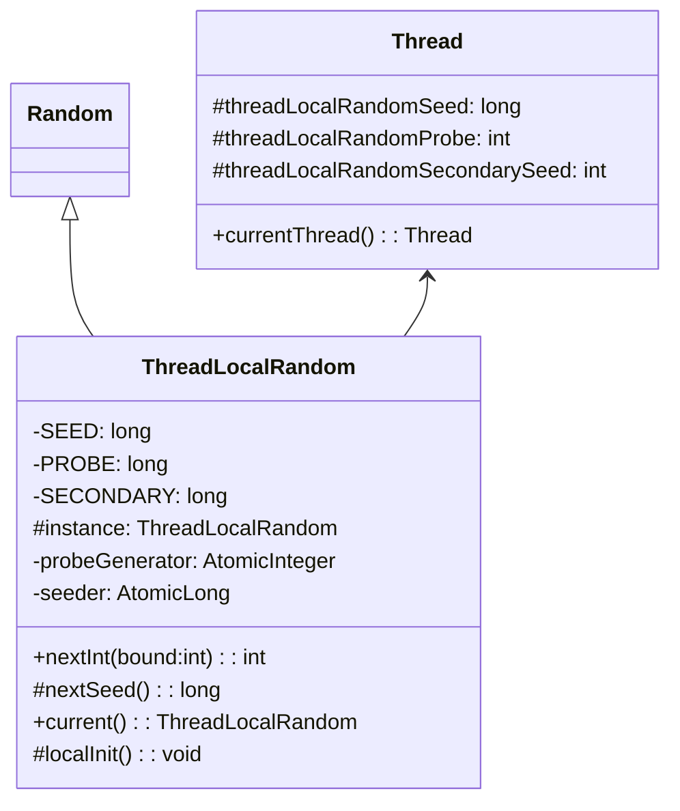
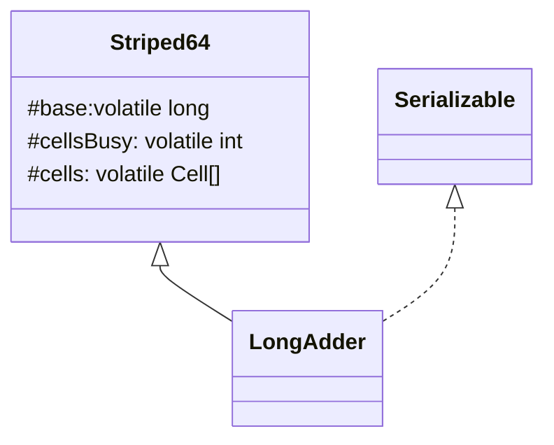

## Java 并发编程总结

#### 进程和线程

#### 线程的状态

#### Thread 相关的各个方法

* thread.sleep

  sleep 在休眠一段时间后自动唤醒，并且休眠时不会释放掉锁

* thread.join

  是对 object.wait 方法的封装，会让调用线程获取到该 thread 对象锁，然后调用 thread.wait 使当前线程阻塞。在 thread 运行结束以后，会在 exit() 中调用 notifyAll() 唤醒调用者线程。

  ```java
  public final synchronized void join(long millis) throws InterruptedException {
          long base = System.currentTimeMillis();
          long now = 0;
          if (millis < 0) {
              throw new IllegalArgumentException("timeout value is negative");
          }
          if (millis == 0) {
              while (isAlive()) {
                  wait(0);
              }
          } else {
              // 这里使用 while 循环 wait 是防止线程被 interrupt，导致提前被唤醒，上面的 while 同理
              while (isAlive()) {
                  long delay = millis - now;
                  if (delay <= 0) {
                      break;
                  }
                  wait(delay);
                  now = System.currentTimeMillis() - base;
              }
          }
      }
  ```

* Thread.yield 静态方法，出让当前线程的时间片使用权，让调度器进行下一轮调度。不会阻塞当前线程。

* object.wait 线程获取到 object 锁，wait 进入阻塞状态，释放掉锁资源

* object.notify 线程获取到 object 锁，通知被 object wait 阻塞的线程，然后释放掉锁资源。具体唤醒哪个线程是随机的，notifyAll 可以唤醒所有因为 wait 被阻塞的线程。

* thread.interrupt 仅仅改变线程地 interrupt 标志位，不会立即停止线程执行。如果线程处于阻塞状态 sleep/join/wait，那么会抛出 InterruptedException

* thread.isInterrupted 是否被中断，不会重置标志位

  ```java
  public boolean isInterrupted() {
     		// false 不重置标志位
          return isInterrupted(false);
      }
  ```

* Thread.inerrupted 调用者线程是否被中断，重置标志位

  ```java
  public static boolean interrupted() {
          return currentThread().isInterrupted(true);
      }
  ```


#### ThreadLocal

ThreadLocal


#### 各种锁的分类

| 锁的分类   | 描述                                                         |
| ---------- | ------------------------------------------------------------ |
| 悲观锁     | 悲观地认为程序并发量很大，很容易产生数据修改冲突。比如 sychronized |
| 乐观锁     | 乐观地认为程序并发量并不大，不容易产生数据冲突，比如 CAS     |
| 公平锁     | 多线程竞争锁时，线程按照顺序排队                             |
| 非公平锁   | 多线程竞争锁时，线程没有顺序                                 |
| 独占锁     | 只能由被单个线程占有，比如 synchronized、ReentrantLock       |
| 共享锁     | 能被多个线程同时占有                                         |
| 可重入锁   | 当该线程获取到锁后，下一个同步语句不需要重新获取这个锁，比如 sychronized |
| 非可重入锁 | 当该线程获取到锁后，下一个同步语句需要重新获取这个锁         |
| 自旋锁     | 线程在竞争获取锁，没有获取到就一直进行循环尝试获取           |


#### synchronized 关键字


#### volatile 关键字


#### CAS  机制

CAS 是一种无锁编程的并发实现。JUC 的 Atomic 包 和 Lock 锁底层均是该机制，1.6 以后 sychronize 关键字在升级为重量级锁之前也是使用 CAS。

CAS 需要三个基本操作数，变量的内存地址 v，旧的预期值 A， 要修改的新值 B，如 JUC Atomic 包中的各种原子类的实现，比如：

```java
 public final boolean compareAndSet(int expect, int update) {
        return unsafe.compareAndSwapInt(this, valueOffset, expect, update); 
     // compareAndSwapInt 是 native 方法
    }
```

旧的期望值加了 volatile 关键字，得到期望值后，在某个线程要更改变量值之前，将期望值和当前值进行比较，如果不相等则更改失败，该线程进入自旋状态，不断循环尝试 CAS 操作，直到操作成功。

##### ABA 问题

某个变量值 A->B->A ，当多个线程同时修改该变量，某个线程阻塞的情况下，可能会出现错误。

加版本号解决 ABA 问题。**AtomicStampedReference** 类实现了版本号的 CAS。

#####  场景

CAS 属于乐观锁，乐观地认为程序地并发量不大，一般不会造成数据修改冲突，适用于并发量不大的业务场景。

#### Unsafe 类

Java 语言不像 C，C++ 那样可以直接访问底层操作系统，但是 JVM 为我们提供了一个后门，这个后门就是unsafe。unsafe 为我们提供了硬件级别的原子操作。Java 中的 **CAS 原子操作的实现就依靠 Unsafe 类**。

上述的 valueOffset 对象，是通过 unsafe.objectFieldOffset 方法得到，所代表的是 AtomicInteger 对象 value 成员变量在内存中的偏移量。我们可以简单地把 valueOffset 理解为 value 变量的内存地址。

Unsafe 类不能直接用 new 创建，构造函数私有。

```java
@CallerSensitive
    public static Unsafe getUnsafe() {
        Class var0 = Reflection.getCallerClass();
        if (!VM.isSystemDomainLoader(var0.getClassLoader())) {
            throw new SecurityException("Unsafe");
        } else {
            return theUnsafe;
        }
    }
```

getUnsafe() 得到的实例，只能被 BootStrapClassLoader 类加载器加载，而不能被 AppClassLoader 加载。所以不能直接在代码中使用 getUnsafe 来获取 Unsafe 实例，但是可以通过**反射**绕过此机制来创建 Unsafe。

**所有在 JAVA_HOME/jre/lib 中的类都会由 BootStrap 来加载**。

#### 伪共享

CPU 中的缓存行大小一般是 2 的幂次方字节数，从主存中加载数据到缓存行中时，是一次加载一整个缓存行的大小。所以缓存行中不只有单个变量而是多个变量。当多个线程同时修改这多个变量时，实际上，某一时刻也只有一个线程能操作缓存行，相比于将多个变量分别放入到不同的缓存行，效率更低。体现了程序运行的**局部性原则**。

##### 如何避免伪共享？

* JDK8 以前通过字节填充来避免伪共享。

  ```java
  public final static class FilledLong {
          public volatile long value = 0L;
          public long p1,p2,p3,p4p5,p6; // 填充
      }
  ```

* JDK8 提供了 sun.misc.Contended 注解

  ```java
  @sun.misc.Contended
  public final static class FilledLong {
  	public volatile long value = 0L;
  }
  ```

  可以修饰类，也可以修饰变量。

  比如 Thread 类中：

  ```java
   /** The current seed for a ThreadLocalRandom */
      @sun.misc.Contended("tlr")
      long threadLocalRandomSeed;
  
      /** Probe hash value; nonzero if threadLocalRandomSeed initialized */
      @sun.misc.Contended("tlr")
      int threadLocalRandomProbe;
  
      /** Secondary seed isolated from public ThreadLocalRandom sequence */
      @sun.misc.Contended("tlr")
      int threadLocalRandomSecondarySeed;
  ```


#### JUC 之 ThreadLocalRandom 

ThreadLocalRandom 是 JDK 7 在 JUC 包下新增的随机数生成器，它弥补了 Random 类在多线程下的缺陷。

Random 类根据种子生成随机数 ，所以在多线程情况下，每个线程有可能获取到相同种子，从而每个线程得到相同的随机数。

Random 类中使用了 AtomicLong 类型的原子性 seed 来避免这种情况，如下：

```java
protected int next(int bits) {
        long oldseed, nextseed;
        AtomicLong seed = this.seed;
        do {
            oldseed = seed.get();
            nextseed = (oldseed * multiplier + addend) & mask;
        } while (!seed.compareAndSet(oldseed, nextseed));
        return (int)(nextseed >>> (48 - bits));
    }
```

但是在并发量很大的情况下，会造成过多线程处于自旋重试状态，降低并发性能，因此有 ThreadLocalRandom 来解决这个问题。



如图所示，ThreadLocalRandom 和 ThreadLocal 类似，本质上都是工具类。ThreadLocalRandom 可以看成一个饿汉式单例。ThreadLocalRandom 的 current() 静态方法如下：

```java
public static ThreadLocalRandom current() {
        if (UNSAFE.getInt(Thread.currentThread(), PROBE) == 0)
            localInit();
        return instance;
    }
```

在 localInit 方法中，初始化当前调用者线程的三个 threadLocalRandom 变量：

```java
static final void localInit() {
        int p = probeGenerator.addAndGet(PROBE_INCREMENT);
        int probe = (p == 0) ? 1 : p; // skip 0
        long seed = mix64(seeder.getAndAdd(SEEDER_INCREMENT));
        Thread t = Thread.currentThread();
        UNSAFE.putLong(t, SEED, seed);
        UNSAFE.putInt(t, PROBE, probe);
    }
```

这里的 probeGenerator 和 seeder 是原子类，因为在多个线程同时初始化的时候，必须保证**每个线程的种子不同**。

再看 nextInt(int bound) 方法：

```java
public int nextInt(int bound) {
        if (bound <= 0)
            throw new IllegalArgumentException(BadBound);
        int r = mix32(nextSeed());
        int m = bound - 1;
        if ((bound & m) == 0) // power of two
            r &= m;
        else { // reject over-represented candidates
            for (int u = r >>> 1;
                 u + m - (r = u % bound) < 0;
                 u = mix32(nextSeed()) >>> 1)
                ;
        }
        return r;
    }

final long nextSeed() {
        Thread t; long r; // read and update per-thread seed
        UNSAFE.putLong(t = Thread.currentThread(), SEED,
                       r = UNSAFE.getLong(t, SEED) + GAMMA);
        return r;
    }
```

这些方法都是与线程无关的通用算法，因为种子是保存在线程内部的，所以这样也是线程安全的。

总而言之，**ThreadLocalRandom 就是帮助每个线程生成不同种子放在各个线程内部，这样线程产生随机数的时候可以互不影响。**

#### JUC 之 Atomic 包

JUC 包中提供了一系列的原子性操作类，都是使用非阻塞的 CAS 算法来实现的。要注意，**CAS 算法只能满足原子性，不能满足可见性和有序性，所以在如 AtomicInteger 等类中，value 是加了 volatile 关键字的，用来满足可见性和有序性。**

以 AtomicLong 为例，

```java
public class AtomicLong extends Number implements java.io.Serializable {
    private static final long serialVersionUID = 1927816293512124184L;
    // 获取 unsafe 实例
    private static final Unsafe unsafe = Unsafe.getUnsafe();
    // 存放值 value 的偏移量
    private static final long valueOffset;
    // 是否 JVM 是否支持 Long 类型无锁 CAS
   	static final boolean VM_SUPPORTS_LONG_CAS = VMSupportsCS8();
    private static native boolean VMSupportsCS8();

    static {
        try {
            // 获取 value 在该类中的属性的偏移量
            valueOffset = unsafe.objectFieldOffset
                (AtomicLong.class.getDeclaredField("value"));
        } catch (Exception ex) { throw new Error(ex); }
    }
    
    // 使用 volatile 关键字保证可见性和有序性
    private volatile long value;

    /**
     * Creates a new AtomicLong with the given initial value.
     *
     * @param initialValue the initial value
     */
    public AtomicLong(long initialValue) {
        value = initialValue;
    }

    /**
     * Creates a new AtomicLong with initial value {@code 0}.
     */
    public AtomicLong() {
    }
    ...
}
```

再看递增操作：

```java
    public final long incrementAndGet() {
        return unsafe.getAndAddLong(this, valueOffset, 1L) + 1L;
    }
```

Unsafe 中：

```java
public final long getAndAddLong(Object var1, long var2, long var4) {
        long var6;
        do {
            var6 = this.getLongVolatile(var1, var2);
        } while(!this.compareAndSwapLong(var1, var2, var6, var6 + var4));// compareAndSwapLong 是 native 方法
        return var6;
    }
```

上面的代码很好懂。

并发量较低的情况下，CAS 优于 synchronized 关键字。但是在并发量高的情况下，由于大量线程的自旋，会导致白白浪费 CPU 资源，因此 JDK 8 新增了一个 LongAdder 类来克服高并发情况下 AtomicLong 的缺点。

##### LongAdder

LongAdder 的基本思想是，既然多个线程同时更新一个原子变量会造成性能浪费，那就让同时让多个线程同时分组，每组更新不同的线程，这样就在一定程度上避免了性能浪费。




cells 就是要更新的数组，大小为 2 的幂次。

cellsBusy 是数组扩容或创建时的自旋锁，只有 0 和 1 两种状态。

先看 Cell 类型：

```java
@sun.misc.Contended static final class Cell {
        volatile long value;
        Cell(long x) { value = x; }
        final boolean cas(long cmp, long val) {
            return UNSAFE.compareAndSwapLong(this, valueOffset, cmp, val);
        }

        // Unsafe mechanics
        private static final sun.misc.Unsafe UNSAFE;
        private static final long valueOffset;
        static {
            try {
                UNSAFE = sun.misc.Unsafe.getUnsafe();
                Class<?> ak = Cell.class;
                valueOffset = UNSAFE.objectFieldOffset
                    (ak.getDeclaredField("value"));
            } catch (Exception e) {
                throw new Error(e);
            }
        }
    }
```

Cell 类型相当于一个精简版的 AtomicLong ，注意它加了 @sun.misc.Contended 注解以解决数组元素伪共享的问题。

重点看 LongAdder 类中的 add 方法：

```java
public void add(long x) {
        Cell[] as; long b, v; int m; Cell a;
        if ((as = cells) != null || !casBase(b = base, b + x)) { // 1
            boolean uncontended = true;
            if (as == null || (m = as.length - 1) < 0 || // 2
                (a = as[getProbe() & m]) == null || // 3
                !(uncontended = a.cas(v = a.value, v + x))) //4
                longAccumulate(x, null, uncontended); // 5
        }
    }
```

+ 代码 1：判断 cells 数组是否为空，如果为空的话，直接 cas 更新 base；如果 cas 操作失败，说明多个线程同时调用 add，那么需要初始化数组，即在 longAccumulate 中初始化。

+ 代码 2,3,4 合起来看，相当于获取当前线程应该访问的那个 cells 数组中的 Cell 元素，然后进行更新。

  as[getProbe & m] 获取到 cells 数组中的那个值，然后代码 4 进行 cas 操作更新这个值。很明显，如果获取到的值是空，那么就需要初始化这个值，意味着数组需要扩容或者初始化；如果 cas 失败的话，意味着多线程竞争更新该值，为了不让线程白白自旋，可要考虑数组的扩容，因此进入 longAccumulate。

看 longAccumulate 方法：

```java
final void longAccumulate(long x, LongBinaryOperator fn,
                              boolean wasUncontended) {
        int h;
        if ((h = getProbe()) == 0) {
            ThreadLocalRandom.current(); // getProbe() 其实就是在获取 ThreadLocalRandom 里面 threadLocalRandomProbe 的值
            h = getProbe();
            wasUncontended = true;
        }
        boolean collide = false;                // True if last slot nonempty
        for (;;) {
            Cell[] as; Cell a; int n; long v;
            if ((as = cells) != null && (n = as.length) > 0) {
                if ((a = as[(n - 1) & h]) == null) {
                    if (cellsBusy == 0) {       //（1） 该线程对应的 cell 为空，数组增加这个 cell
                        Cell r = new Cell(x);    
                        if (cellsBusy == 0 && casCellsBusy()) {
                            boolean created = false;
                            try {               // Recheck under lock
                                Cell[] rs; int m, j;
                                if ((rs = cells) != null &&
                                    (m = rs.length) > 0 &&
                                    rs[j = (m - 1) & h] == null) {
                                    rs[j] = r;
                                    created = true;
                                }
                            } finally {
                                cellsBusy = 0;
                            }
                            if (created)
                                break;
                            continue;           // Slot is now non-empty
                        }
                    }
                    collide = false;
                }
                else if (!wasUncontended)       // CAS already known to fail
                    wasUncontended = true;      // Continue after rehash
                //（2） 当前 cell 存在，进行 cas 操作
                else if (a.cas(v = a.value, ((fn == null) ? v + x :
                                             fn.applyAsLong(v, x))))
                    break;
                else if (n >= NCPU || cells != as) // (3) 元素个数大于 CPU 个数
                    collide = false;            // At max size or stale
                else if (!collide) // (4)
                    collide = true;
                else if (cellsBusy == 0 && casCellsBusy()) { // (5) 元素个数小于 CPU 个数，给数组扩容
                    try {
                        if (cells == as) {      // Expand table unless stale
                            Cell[] rs = new Cell[n << 1];
                            for (int i = 0; i < n; ++i)
                                rs[i] = as[i];
                            cells = rs;
                        }
                    } finally {
                        cellsBusy = 0;
                    }
                    collide = false;
                    continue;                   // Retry with expanded table
                }
                h = advanceProbe(h); // (6) rehash
            }
            // 可以
            else if (cellsBusy == 0 && cells == as && casCellsBusy()) {
                boolean init = false;
                try {                           // Initialize table
                    if (cells == as) {
                        Cell[] rs = new Cell[2];
                        rs[h & 1] = new Cell(x);
                        cells = rs;
                        init = true;
                    }
                } finally {
                    cellsBusy = 0;
                }
                if (init)
                    break;
            }
            else if (casBase(v = base, ((fn == null) ? v + x :
                                        fn.applyAsLong(v, x))))
                break;                          // Fall back on using base
        }
    }
```

cellsBusy 是一个标示，为 0 说明数组没有在初始化或者扩容，也没有新建 Cell 元素，为 1 则相反。

数组初始化很好理解，如果 cells 为空就去初始化，同时 cellsBusy 标示置为 1 ，避免重复初始化。一个线程初始化数组，另一个线程就通过最外层的 for 循环自旋等待。

线程 1 将数组初始化成功了以后，就 break 退出循环，其余线程开始竞争修改变量。

注意，每个线程的 threadLocalRandomProbe 是不一样的，但是 probe & (n - 1) 的结果可能一样，多个线程的情况下更容易发生这个问题。实际上 probe 就是一个 hash 值，这里确定数组下标的方式，类似于 hashmap 。

如果两个线程的 h = probe & (n - 1) 相同，即发生了 hash 碰撞，考虑一下两种情况：

+ 该 h 对应的 Cell 不为空

  不为空，则两者同时竞争修改同一个 Cell ，只有一个线程能修改成功，通过代码（2）处的 a.cas 来确保原子性。另外一个线程走到其余分支条件。

  代码 (3) 处，判断数组容量是否大于 CPU 个数，如果大于的话，说明数组容量有富余，不需要扩容，collide 置为 false，然后在代码 (5) 处 rehash，再循环。

  如果数组容量小于 CPU 个数，那么数组容量不够，collide 置为 true，意味着数组需要扩容。但是不立马扩容，而是先 rehash 再尝试修改。如果 rehash 以后仍然 cas 失败，那么就进行数组扩容。

  数组扩容可以把并发修改单个原子变量的性能压力分摊给了多个数组，而不会白白自旋浪费性能。

  由上可知，对于多个线程同时修改同一个 cell ，**先 rehash，再考虑数组扩容**。

+ 该 h 对应的 Cell 为空

  如果 cell 为空，那么先在代码 (1) 处新建 cell，同时将 cellsBusy 置为 1 。接下来的过程与上述相同。

最后，为什么要用 cellsBusy 来标示？因为单纯对变量的 CAS 原子操作作用范围有限，对于数组的结构变化，需要这种方式来保证多线程间的同步。

