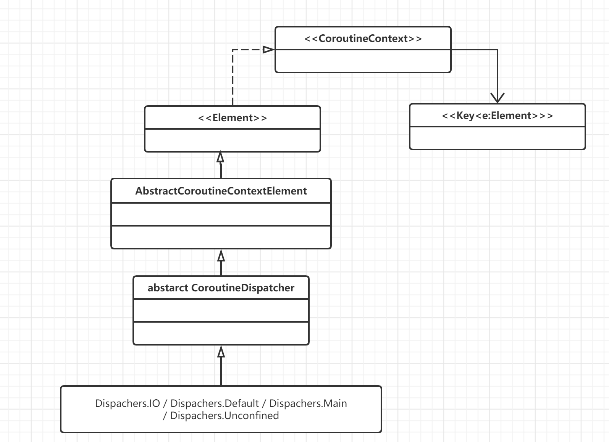
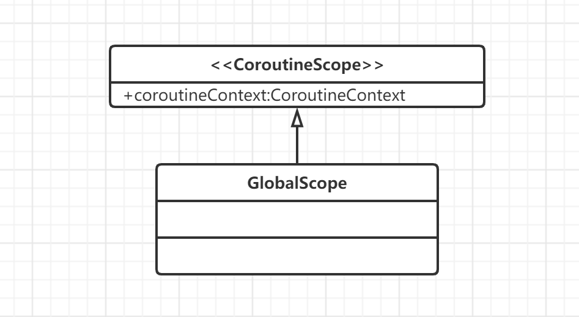
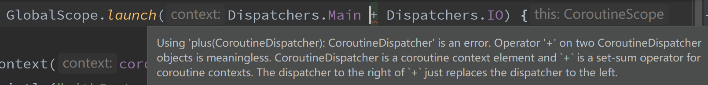

## Kotlin 协程

### 一、CoroutineScope & CoroutineContext

https://stackoverflow.com/questions/54416840/kotlin-coroutines-scope-vs-coroutine-context

#### CoroutineScope 

* 一个协程必须在 scope 里运行
* scope 可以追踪到在其内部运行的协程
* 所有的协程都可以通过这个 scope 取消
* scope 可以捕获 uncaught exceptions
* scope 是一种可以将协程绑定在应用特定生命周期的东西，比如 viewModelScope 可以避免 viewModel 泄露

#### CoroutineContext

context 决定了协程运行在哪个线程上。

* Dispatchers.Default - 适合计算密集型工作
* Dispatchers.Main - 主线程
* Dispatchers.Unconfined - 任意一个线程，没有限制
* Dispatchers.IO - 适合 IO 工作，比如数据库操作



  

 

CoroutineContext 通过诸如 Dispatchers.Main 等调度器来决定协程运行在哪个线程上，但是，CoroutineContext 不只是一个线程调度器。除了调度器，其他可以视作 CoroutineContext 的东西有 Job`, `Deferred，CoroutineName`, `CoroutineExceptionHandler 等一切实现了 Element 接口的类。

参考：https://stackoverflow.com/questions/60502591/whats-the-purpose-of-combining-coroutine-contexts-in-kotlin

而对于 CoroutineContext  中重载的 + 运算符，它的作用类似于添加配置作用到 context 外部的 scope。通过给一个 context 加上一个新的 context，生成新的 combined coroutine context。

不允许直接将两个调度器相加，这样做是没有意义的，因为一个协程一定只运行在一个调度器之上，并且这样写编译器也会报错。



如果只是 context + Dispatcher，对于协程来说，永远运行在最后一个加上的 Dispatcher 上。一个很好的例子就是返回 CoroutineLiveData 对象的 liveData() 顶层函数。我们可以这样使用 liveData 函数：

```kotlin
// 应用里
fun searchPlaces(query: String) = liveData(Dispatchers.IO) { // 这里把整个 block 切到了 IO 线程上
        val result = getResult() // 耗时操作
        emit(result) // 这里调用了 LiveDataScope.emit(T)
    }

// LiveDataScopeImpl.class
var target: CoroutineLiveData<T>
private val coroutineContext = context + Dispatchers.Main.immediate // 添加 Main 调度器
override suspend fun emit(value: T) = withContext(coroutineContext) { // 这里把上面本来在 IO 线程上运行的 block 切到了 Main 主线程，因为 liveData 的 setValue 方法必须在主线程调用
        target.clearSource()
        target.value = value
    }

```

不过 liveData() 函数的返回值不适合直接用在 ViewModel 里并在 Activity 里面监听。因为它的 block 是在 coroutineLiveData 对象 onActive 的时候执行的，即给它添加 Observer 的时候执行，并非是在 setValue / postValue 的时候执行。

