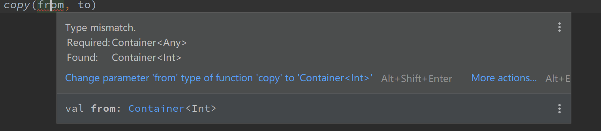
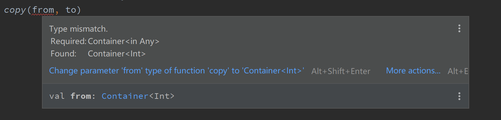

## 谈谈 kotlin 的协变与逆变 -- 从 Java 说起

### 前言

为了更好地理解 kotlin 中的协变与逆变，先看一些基础知识。

#### 普通赋值

在 Java 中，常见的赋值语句如下：

```java
A a = b;
```

赋值语句必须满足的条件是：左边要么是右边的父类，要么和右边类型一样。即 A 的类型要“大于”B 的类型，比如 `Object o = new String("s");` 。为了方便起见，下文中称作 A > B。

除了上述最常见的赋值语句，还有两种其他的赋值语句：

#### 函数参数的赋值

```java
public void fun(A a) {}
// 调用处赋值
B b = new B();
fun(b);
```

在调用 fun(b) 方法时，会将传入的 B b 实参赋值给形参 A a，即 `A a = b` 的形式。同样的，必须要满足形参类型大于实参，即 A > B。

#### 函数返回值的赋值

```java
public A fun() {
    return (B)b;
} 
```

函数返回值类型接收实际返回类型的值，实际返回类型 B b 相当于赋值给了函数返回值类型 A a，即 B b 赋值给了 A a, 即 `A a = b`，那么必须满足 A > B 的类型关系。

所以，无论哪种赋值，都必须满足左边类型 > 右边类型，即 A > B。

### Java 中的协变与逆变

有了前面的基础知识，就可以方便地解释协变与逆变了。

如果类 A > 类 B，经过一个变化 trans 后得到的 trans(A) 与 trans(B) 依旧满足 trans(A) > trans(B)，那么称为**协变**。

逆变则刚好相反，如果类 A > 类 B，经过一个变化 trans 后得到的 trans(A) 与 trans(B) 满足 trans(B) > trans(A)，称为**逆变**。

比如大家都知道 Java 的数组是协变的，假如 A > B，那么有 A[] > B[]，所以 B[] 可以赋值给 A[]。举个例子：

```java
Integer[] nums = new Integer[]{};
Object[] o = nums; // 可以赋值，因为数组的协变特性所以 Object[] > int[]
```

但是 Java 的泛型则不满足协变，如下：

```java
List<Integer> l = new ArrayList<>();
List<Object> o = l;// 这里会报错，不能编译
```

上述代码报错，就是因为，虽然 Object > Integer，但是由于泛型不满足协变，所以 List<Object> > List<Integer> 是不能满足的，既然不满足左边大于右边这个条件，从前言中我们知道，自然就不能将 List<Integer> 赋值给 List<Object>。一般称 Java 泛型不支持型变。

### Java 中泛型如何实现协变与逆变

从前面我们知道，在 Java 中泛型是不支持型变的，但是这会产生一个让人很奇怪的疑惑，也是很多讲泛型的文章中提到的：

如果 B 是 A 的子类，那么 List<B> 就应该是 List<A> 的子类呀！这是一个非常自然而然的想法！

但是很抱歉，由于种种原因，Java 并不支持。但是，Java 并不是完全抹杀了泛型的型变特性，Java 提供了 <? extends T> 和 <? super T> 使泛型拥有协变和逆变的特性。

#### <? extends T> 与 <? super T>

<? extends T> 称为上界通配符，<? super T> 称为下界通配符。使用上界通配符可以使泛型协变，而使用下界通配符可以使泛型逆变。

比如之前举的例子

```java
List<Integer> l = new ArrayList<>();
List<Object> o = l;// 这里会报错，不能编译
```

如果使用上界通配符，

```java
List<Integer> l = new ArrayList<>();
List<? extends Object> o = l;// 可以通过编译
```

这样，List<? extends Object> 的类型就大于 List<Integer> 的类型了，也就实现了协变。这也就是所谓的“子类的泛型是泛型的子类”。

同样，下界通配符 <? super T> 可以实现逆变，如：

```java
public List<? super Integer> fun(){
    List<Object> l = new ArrayList<>();
    return l;
}
```

上述代码怎么就实现逆变了呢？首先，Object > Integer；另外，从前言我们知道，函数返回值类型必须大于实际返回值类型，在这里就是 `List<? super Integer>` > `List<Object>`，和 Object > Integer 刚好相反。也就是说，经过泛型变化后，Object 和 Integer 的类型关系翻转了，这就是逆变，而实现逆变的就是下界通配符 <? super T>。

从上面可以看出，<? extends T> 中的上界是 T，也就是说 <? extends T> 所泛指的类型都是 T 的子类或 T 本身，所以 T 大于 <? extends T> 。<? super T> 中的下界是 T，也就是说 <? super T> 所泛指的类型都是 T 的父类或 T 本身，所以 <? super T>  大于 T。

虽然 Java 使用通配符解决了泛型的协变与逆变的问题，但是由于很多讲到泛型的文章都晦涩难懂，曾经让我一度感慨这 tm 到底是什么玩意？直到我在 stackoverflow 上发现了通俗易懂的解释(是的，前文大部分内容都来自于 stackoverflow 中大神的解释)，才终于了然。其实只要抓住**赋值语句左边类型必须大于右边类型**这个关键点一切就都很好懂了。

#### PECS

PECS 准则即 Producer Extends Consumer Super，生产者使用上界通配符，消费者使用下界通配符。直接看这句话可能会让人很疑惑，所以我们追本溯源来看看为什么会有这句话。

首先，我们写一个简单的泛型类：

```java
public class Container<T> {
    private T item;

    public void set(T t) { 
        item = t;
    }

    public T get() {
        return item;
    }
}
```

然后写出如下代码：

```java
Container<Object> c = new Container<String>(); // (1)编译报错

Container<? extends Object> c = new Container<String>(); // (2)编译通过
c.set("sss"); // (3)编译报错
Object o = c.get();// (4)编译通过
```

代码 (1)，`Container<Object> c = new Container<String>(); ` 编译报错，因为泛型是不型变的，所以 Container<String> 并不是 Container<Object> 的子类型，所以无法赋值。

代码 (2)，加了上界通配符以后，支持泛型协变，Container<String> 就成了 Container<? extends Object> 的子类型，所以编译通过，可以赋值。

既然代码 (2) 通过编译，那代码 (3) 为什么会报错呢？因为代码 (3) 尝试把 String 类型赋值给 <? extends Object> 类型。显然，编译器只知道 <? extends Object>  是 Obejct 的某一个子类型，但是具体是哪一个并不知道，也许并不是 String 类型，所以不能直接将 String 类型赋值给它。

从上面可以看出，对于使用了 <? extends T> 的类型，是不能写入元素的，不然就会像代码 (3) 处一样编译报错。

但是可以读取元素，比如代码 (4) 。该类型只能读取元素，这就是所谓的“生产者”，即你只能从中读取元素的就是生产者，生产者就使用 <? extends T> 通配符。

消费者同理，代码如下：

```java
Container<String> c = new Container<Object>(); // (1)编译报错

Container<? super String> c = new Container<Object>(); // (2)编译通过
 c.set("sss");// (3) 编译通过
 String s = c.get();// (4) 编译报错

```

代码 (1) 编译报错，因为泛型不支持逆变。而且就算不懂泛型，这个代码的形式一眼看起来也是错的。

代码 (2) 编译通过，因为加了 <? super T> 通配符后，泛型逆变。

代码 (3) 编译通过，它把 String 类型赋值给 <? super String>，<? super String> 泛指 String 的父类或 String，所以这是可以通过编译的。

代码 (4) 编译报错，因为它尝试把 <? super String> 赋值给 String，而 <? super String> 大于 String，所以不能赋值。事实上，编译器完全不知道该用什么类型去接受 `c.get()` 的返回值，因为在编译器眼里 <? super String> 是一个泛指的类型，所有 String 的父类和 String 本身都有可能。

同样从上面代码可以看出，对于使用了 <? super T> 的类型，是不能读取元素的，不然就会像代码 (4) 处一样编译报错。但是可以写入元素，比如代码 (3)。该类型只能写入元素，这就是所谓的“消费者”，即你只能写入元素的就是消费者，消费者就使用 <? super T> 通配符。

综上，这就是 PECS 原则。

### kotlin 中的协变与逆变

kotlin 抛弃了 Java 中的通配符，转而使用了**声明处型变**与**类型投影**。

#### 声明处型变

首先让我们回头看看 Container 的定义：

```java
public class Container<T> {
    private T item;

    public void set(T t) { 
        item = t;
    }

    public T get() {
        return item;
    }
}
```

在某些情况下，我们只会使用 `Container<? extends T>` 或者 `Container<? super T>` ，意味着我们只使用 Container 作为生产者或者 Container 作为消费者。

既然如此，那我们为什么要在定义 Container 这个类的时候要把 get 和 set 都定义好呢？试想一下，如果一个类只有消费者的作用，那定义 get 方法完全是多余的。

反过来说，如果一个泛型类只有生产者方法，比如下面这个例子（来自 kotlin 官方文档）:

```kotlin
// Java
interface Source<T> {
  T nextT(); // 只有生产者方法
}
// Java
void demo(Source<String> strs) {
  Source<Object> objects = strs; // ！！！在 Java 中不允许，要使用上界通配符 <? extends Object>
  // ……
}
```

在 `Source ` 类型的变量中存储 `Source ` 实例的引用是极为安全的——没有消费者-方法可以调用。然而 Java 依然不让我们直接赋值，需要使用上界通配符。

但是这是毫无意义的，使用通配符只是把类型变得更复杂，并没有带来额外的价值，因为能调用的方法还是只有生产者方法。但编译器并不知道这回事。

所以，如果我们能在使用之前确定一个类是生产者还是消费者，那在定义类的时候直接声明它的角色岂不美哉？

这就是 kotlin 的声明处型变，直接在类声明的时候，定义它的型变行为。

比如：

```java
class Container<out T> { // (1)
    private  var item: T? = null 
        
    fun get(): T? = item
}

val c: Container<Any> = Container<String>()// （2）编译通过，因为 T 是一个 out-参数
```

(1) 处直接使用 <out T> 指定 T 类型只能出现在生产者的位置上。虽然多了一些限制，但是，在 kotlin 编译器直到了 T 的角色以后，就可以像 (2) 处一样将 Container<String> 直接赋值给 Container<Any>，好像**泛型直接可以协变了一样**，而不需要再使用 Java 当中的通配符 <? extends String>。

同样的，对于消费者来说，

```kotlin
class Container<in T> { // (1) 
    private  var item: T? = null 
     fun set(t: T) {
        item = t
    }
}

val c: Container<String> = Container<Any>() // (2) 编译通过,因为 T 是一个 in-参数
```

代码 (1) 处使用 <in T> 指定 T 类型只能出现在消费者的位置上。代码 (2) 可以编译通过， Any > String，但是 Container<String> 可以被 Container<Any> 赋值，意味着 Container<String> 大于 Container<Any> ，即它看上去就像 **T 直接实现了泛型逆变**，而不需要借助 <? super String> 通配符来实现逆变。如果是 Java 代码，则需要写成 `Container<? super String> c = new Container<Object>(); `。

这就是**声明处型变**，在类声明的时候使用 out 和 in 关键字，在使用时可以直接写出泛型型变的代码。

而 Java 在使用时必须借助通配符才能实现泛型型变，这是**使用处型变**。

#### 类型投影

有时一个类既可以作生产者又可以作消费者，这种情况下，我们不能直接在 T 前面加 in 或者 out 关键字。比如：

```kotlin
class Container<T> {
    private  var item: T? = null
    
    fun set(t: T？) {
        item = t
    }

    fun get(): T? = item
}
```

考虑这个函数：

```kotlin
fun copy(from: Container<Any>, to: Container<Any>) {
    to.set(from.get())
}
```

当我们实际使用该函数时：

```kotlin
val from = Container<Int>()
val to = Container<Any>()
copy(from, to) // 报错，from 是 Container<Int> 类型，而 to 是 Container<Any> 类型
```



这样使用的话，编译器报错，因为我们把两个不一样的类型做了赋值。用 kotlin 官方文档的话说，copy 函数在”干坏事“， 它尝试**写**一个 Any 类型的值给 from， 而我们用 Int 类型来接收这个值，如果编译器不报错，那么运行时将会抛出一个 `ClassCastException` 异常。

所以应该怎么办？直接防止 from 被写入就可以了！将 copy 函数改为如下所示：

```kotlin
fun copy(from: Container<out Any>, to: Container<Any>) { // 给 from 的类型加了 out
    to.set(from.get())
}
val from = Container<Int>()
val to = Container<Any>()
copy(from, to) // 不会再报错了
```

这就是**类型投影**：from 是一个类受限制的（投影的）Container 类，我们只能把它当作生产者来使用，它只能调用 get() 方法。

同理，如果 from 的泛型是用 in 来修饰的话，则 from 只能被当作消费者使用，它只能调用 set() 方法，上述代码就会报错：

```kotlin
fun copy(from: Container<in Any>, to: Container<Any>) { // 给 from 的类型加了 in
    to.set(from.get())
}
val from = Container<Int>()
val to = Container<Any>()
copy(from, to) //  报错
```



其实从上面可以看到，类型投影和 Java 的通配符很相似，也是一种**使用时型变**。

### 为什么要这么设计？

为什么 Java 的数组是默认型变的，而泛型默认不型变呢？其实 kolin 的泛型默认也是不型变的，只是使用 out 和 in 关键字让它看起来像泛型型变。

为什么这么设计呢？为什么不默认可型变呢？

在 stackoverflow 上找到了答案，参考：https://stackoverflow.com/questions/18666710/why-are-arrays-covariant-but-generics-are-invariant

>Java 和 C# 早期都是没有泛型特性的。
>
>但是为了支持程序的多态性，于是将数组设计成了协变的。因为数组的很多方法应该可以适用于所有类型元素的数组。
>
>比如下面两个方法：
>
>```java
>boolean equalArrays (Object[] a1, Object[] a2);
>void shuffleArray(Object[] a);
>```
>
>第一个是比较数组是否相等；第二个是打乱数组顺序。
>
>语言的设计者们希望这些方法对于任何类型元素的数组都可以调用，比如我可以调用 shuffleArray(String[] s) 来把字符串数组的顺序打乱。
>
>出于这样的考虑，在 Java 和 C# 中，数组设计成了协变的。
>
>然而，对于泛型来说，却有以下问题：
>
>```java
>// Illegal code - because otherwise life would be Bad
>List<Dog> dogs = new List<Dog>();
>List<Animal> animals = dogs; // Awooga awooga
>animals.add(new Cat());// (1)
>Dog dog = dogs.get(0); //(2) This should be safe, right?
>```
>
>如果上述代码可以通过编译，即 List<Dog> 可以赋值给 List<Animal>，List 是协变的，那么我完全可以往 List<Dog> 中 add 一个 Cat()，如代码 (1) 处。这样就有可能造成代码 (2) 处的接收者 dog 和 dogs.get(0) 的类型不匹配的问题。会引发运行时的异常。所以 Java 在编译期就要阻止这种行为，把泛型设计为默认不型变的。

###  总结

1、Java 泛型默认不型变，所以 List<String> 不是 List<Object> 的子类。如果要实现泛型型变，则需要 <? extends T> 与 <? super T> 通配符，这是一种使用处型变的方法。使用 <? extends T> 通配符意味着该类是生产者，只能调用 get(): T 之类的方法。而使用 <? super T> 通配符意味着该类是消费者，只能调用 set(T t)、add(T t) 之类的方法。

2、Kotlin 泛型其实默认也是不型变的，只不过使用 out 和 in 关键字在类声明处型变，可以达到在使用处看起来像直接型变的效果。但是这样会限制类在声明时只能要么作为生产者，要么作为消费者。

使用类型投影可以避免类在声明时被限制，但是在使用时要使用 out 和 in 关键字指明这个时刻类所充当的角色是消费者还是生产者。类型投影也是一种使用处型变的方法。

