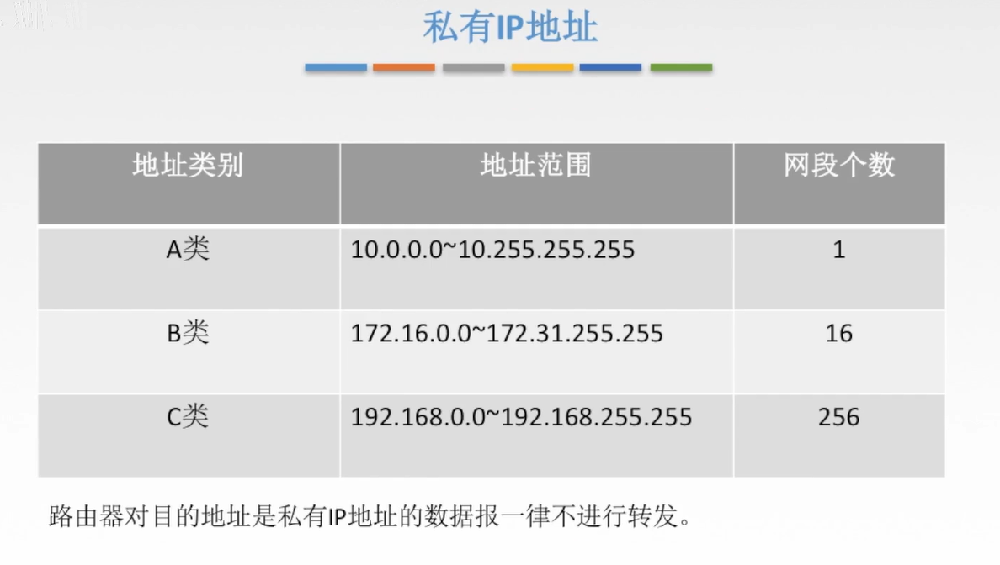

## 计算机网络复习

### 一、基本概念

* 单工通信

  只有一个方向的通信而没有反方向的交互，仅需要一条信道（发送信道或接收信道）。

* 半双工通信

  通信的双方都可以接收或发送信息，但是任何一方不能同时接收和发送，需要两条信道

* 全双工通信

  通信双方可以同时接收和发送信息，需要两条信道。
  
* 端对端通信 & 点对点通信

  数据传输的可靠性是通过数据链路层和网络层的点对点和传输层的端对端保证的。

  点对点是基于 MAC 地址或者 IP 地址，是指一个设备发数据给另外一个设备，这些设备是指直连设备包括网卡，路由器，交换机。端对端是应用程序之间的远程通信。端对端不需要知道底层是如何传输的，是一条逻辑链路。

  在一个网络系统的不同分层中，可能用到端到端传输，也可能用到点到点传输。如 Internet 网，IP 及以下各层采用点到点传输，IP 层以上采用端到端传输。

  端对端，主要服务于Application Layer,是说两台主机（终端），跨过网络连接。
  点对点，是说两台主机（终端）在局域网中传输。

### 二、数据链路层

#### 功能

* 为网络层提供服务

  提供的服务包括，无连接无确认服务，无连接有确认服务，有连接有确认服务。

* 链路管理，建立、维持、释放连接。

* 组帧

* 流量控制

* 差错控制 （帧错/位错）

#### 链路层流量控制

* 停止-等待协议
  * 每发送一个帧就停止发送，等待对方的确认，收到确认后在发下一个帧
  * 相当于 发送窗口大小 =  接受窗口大小 = 1 的滑动窗口
* 滑动窗口协议
  * 后退 N 帧协议 GBN
    * 发送窗口大小 > 1，接受窗口大小 = 1
  * 选择重传协议 SR
    * 发送窗口大小 > 1，接受窗口大小 > 1

#### 信道划分介质访问控制

* 静态信道划分
  * 时分复用
  * 频分复用
* 动态信道划分
  * 令牌
  * ALOHA
  * CSMA/CD
  * CSMA/CA

#### 广域网

* 单向信道
* 覆盖网络层、数据链路层和物理层
* ppp 协议（point to point protocol），面向字节协议，全双工
* HDLC 协议，面向比特协议，全双工

#### 局域网

* 广播信道
* 只覆盖物理层和数据链路层
* 某一区域内的计算机组成的网络
* 介质访问
  * CSMA/CD 常用于总线型局域网
  * 令牌总线 & 令牌环
* 局域网分类
  * 以太网 （CSMA/CD）IEEE802.3
  * FDDI
  * ATM
  * 令牌环网（单点故障）
  * 无限局域网 WLAN IEEE802.11

#### 以太网

* 提供无连接、不可靠的服务。只实现无差错接收，差错帧直接丢弃，不向发送方确认。

### 三、网络层

#### 功能

* 路由选择与分组转发
* 异构网络互联
* 拥塞控制

#### 数据交换方式

* 电路交换（电话网络）

* 报文交换

* 分组交换，把数据分割成很多小数据包，以并发的形式在路线上传播，最快的方式，互联网就是用这种方式交换数据

  

* 报文交换与分组交换需要进行存储转发

#### 数据报方式&虚电路方式

* 分组交换方式包括 **数据包交换方式 & 虚电路交换方式 **

* 数据报方式为网络层提供无连接服务

  无连接服务不事先为分组确定传输路路径，每个分组独立确定传输路径，不同分组传输路径可能不同。

* 虚电路方式为网络层提供连接服务

  首先为分组确定传输路径，即建立连接，然后沿该路径传输系列分组，系列分组传输路径相同，传输结束后拆除连接。

  

#### 传输单元名词辨析

#### IP 数据报分片

IP 数据报分片的原因是因为链路层传输受到 MTU （最大传输单元）限制，所以过大的 IP 数据包必须分片传输。

#### IP 地址

IP 地址标识的是路由器和主机的接口，不是标识主机。一台主机可能无线接口和有限接口。路由器可以有多个接口，每个接口有一个 IP 地址，不同的接口可以连不同的网络。

私有 IP 地址如下：

在局域网和英特网之间使用网络地址转换 NAT（Network Address Translation），就可以将私有 IP 转化为外网 IP，然后就可以和英特网通信了。安装了 NAT 软件的路由器成为 NAT 路由器。

#### 子网划分

子网划分用来解决网络 IP 分类的缺点：

* 网络利用率不高。子网划分可以把一个大网划分成很多小网，而不用让很多小网络取申请远超其容量的 A 类或者 B 类网络。
* 很难轻易网络扩大 IP 容量。

IP 地址和子网掩码做按位与运算就可以得出子网网络地址。

#### CIDR 无分类编址

#### ARP 协议

每一台主机上都有 ARP 高速缓存，里面保存了局域网内 IP 地址与 MAC 地址的映射。为什么要有 MAC 地址？因为网络层 IP 数据包向下传输到链路层时，需要在尾部加上 MAC 地址成为帧。

如果缓存内没有对应的 MAC 地址，就会在局域网内广播以获取相应 IP 地址与 MAC 地址的映射。

如果还是没找到，就会把 MAC 地址换成网关的，然后由网关传输到外网。

#### DHCP 协议

动态分配 IP 地址给入网主机。

#### ICMP 协议

当数据报发送出了差错后，就要使用 ICMP 协议来通知源点。

#### 路由算法

* 内部网关协议
  * RIP 协议 & 距离向量算法
  * OSPF 协议 & 链路状态算法
* 外部网关协议
  * BGP 协议

#### IP 数据报的三种传输方式

### 四、传输层

#### 功能

* 提供进程与进程间的逻辑通信
* 复用和分用（复用：主机上的应用进程都可以通过传输层向下传；分用：从传输层收到的报文可以交付到指定进程）

#### 协议

* 面向连接的传输控制协议 TCP，适用于大文件
* 无连接的用户数据报协议 UDP，适合小文件，比如 QQ 消息，表情，QQ 会使用确认帧。

* 端口标识主机中的应用进程，16bit，能表示65536个端口号
  * 服务器端口号，熟知端口号 0-1023 （给 TCP/IP 最重要的一些应用程序，著名端口），等级端口号 1024 - 49151
  * 客户端端口号，49152 - 65535
* 套接字 Socket = （主机 IP 地址，端口号），唯一标识了网络中一个主机和它上面的一个进程。

#### UDP 协议

UDP 只在 IP 数据报服务上增加了很少功能，即复用分用和差错检测功能。

#### TCP 协议

* TCP 时面向连接的传输层协议。（就像打电话）
* 每一条 TCP 连接只能有两个端点，每一条 TCP 连接只能是点对点的
* TCP 提供可靠交付的服务，无差错、不丢失、不重复、按需到达
* TCP 可以提供全双工通信，两端都会有发送缓存和接收缓存
* TCP 面向字节流

#### 三次握手和四次挥手

#### TCP 可靠传输

发送方给字节编序，接收方收到以后会回复发送方确认消息。

TCP 使用累计确认方式。如果已经收到 1、2、3 和 6、7 字节，但是没有收到 4 、5，则接收方会向发送方回复 4 的确认，让发送方重传。发送方再发 4、5 被接收方收到以后，接收方回复 8 确认。

当发送方发送完报文后，没有接收到确认报文，则会超时重传，机制如下：

**那有没有办法在等待时间完之前就能够提前知道是否需要重传呢？**

可以，使用冗余 ACK 机制。

#### TCP 流量控制

TCP 采用滑动窗口来实现流量控制。

在通信过程中，接收方根据自己接收缓存的大小，即接收窗口 rwnd，动态地调整发送方地发送窗口大小。发送方的发送窗口取接收窗口 rwnd 和拥塞窗口 cwnd 的最小值。

#### TCP 拥塞控制

出现拥塞的条件：对资源需求的总和 > 可用资源。

拥塞控制就是防止过多的数据注入到网络当中，这是全局性问题，而不是两端之间的问题。

拥塞窗口和接收窗口：

#### 慢开始和拥塞控制

发送方开始时往网络中从 1 开始注入少数报文段，并且指数增长；直到达到 ssthreash，开始线性增长注入报文段；增长到检测到拥塞后，瞬间将报文段注入数改为 1 ，即初始值，同时把 ssthreash 设为网络拥塞时的 cwnd 报文注入值；然后循环这个过程。

#### 快重传和快恢复

#### TCP/IP 协议栈

看这篇就够了 [一文搞定 UDP 和 TCP 高频面试题！ - 知乎](https://zhuanlan.zhihu.com/p/108822858)

### 五、HTTP

#### HTTP1.0，HTTP1.1，HTTP2.0，HTTPS，HTTP3 有什么区别？

参考：

https://stackoverflow.com/questions/53488601/what-is-difference-between-https-and-http-2

https://stackoverflow.com/questions/36517829/what-does-multiplexing-mean-in-http-2/

https://juejin.im/post/6844903796225785870

https://juejin.im/entry/6844903489596833800

HTTP 协议 spec - https://www.w3.org/Protocols/HTTP/1.0/spec.html

HTTPS - 在 HTTP 和传输层之间加了一层 TLS 协议，客户端和服务端通过一系列操作拿到对称密钥，然后再加密要传输的信息。HTTPS 协议需要到 CA 申请证书，一般免费证书很少，需要交费。HTTP和HTTPS使用的是完全不同的连接方式，用的端口也不一样，前者是 80，后者是 443。

HTTP 2.0 - 可以一次性发送多个请求，并且乱序接收 response，这称为多路复用，multiplexing。数据分为二进制帧传输，一次的请求与响应称为流。帧是流中的数据单位。一个数据报的header 帧可以分成多个 header 帧，data 帧可以分成多个data 帧。

HTTP 1.1 - 在 HTTP 1.1 中，一次链接成功后，只要该链接还没断开，那么 client 端可以在这么一个链接中有序地发起多个请求，并以此获得每个请求对应的响应数据。它的缺点是，一次请求与响应的交互必须要等待前面的请求交互完成，否则后面的只能等待，这个就是**线头阻塞**。举个例子：请求A 和 请求B。A 先被发起，此时 server 端接收到了 A 请求，正在处理。同时 B 请求也发过来了。但是 A 请求还没被返回，此时 B 请求只能等待。

HTTP 1.1支持长连接（PersistentConnection）和请求的流水线（Pipelining）处理，在一个TCP连接上可以传送多个 HTTP 请求和响应，减少了建立和关闭连接的消耗和延迟，在 HTTP1.1 中默认开启Connection： keep-alive，一定程度上弥补了 HTTP1.0 每次请求都要创建连接的缺点。

另外在 header 字段上 http 的不同版本也有区别，比如 http 1.1 支持 chunked 字段，但是 http 2.0 移除了。

#### TSL 获取加密密钥的过程

参考：https://www.ruanyifeng.com/blog/2014/02/ssl_tls.html

SSL / TLS协议的基本过程是这样的：

> （1） 客户端向服务器端索要并验证公钥。
>
> （2） 双方协商生成"对话密钥"。
>
> （3） 双方采用"对话密钥"进行加密通信。

#### 两军问题 & TCP 为什么要建立连接？
面试遇到过的问题，重点在于为什么，而不是怎么建立连接。
首先引入**两军问题**：
> 两个将军 A1 和 A2 决定攻打同一个敌人 B ，任一方都没有敌人强大，所以只有共同进攻才有胜算。敌军正好位于两个将军之间，意味着信使可能会被敌军抓住。两军问题指的就是在这样的条件下两个将军如何就是否进攻达成共识。

这个问题没有乍看起来那么简单。将军 A1 给将军 A2 送信说明天进攻。这样，信使出发后，A1 是没有办法去确认信使是不是真的把信送到了的。这样 A1 就会选择不进攻，因为他怕到时候进攻的只有他自己。要让事情确定一些，A2 需要收到信之后给 A1 一个确认信息，说“我已经收到了你给我的要明天进攻的信息了”。信使在给 A1 送信路上也可能会被抓，这样， A2 会倾向于不进攻，因为他知道 A1 如果收不到他的确认信息是不会发动进攻的。

所以这里的逻辑顺推下来，不管双方试图确认多少次，都不能最终确认跟彼此达成了共识。每个将军都会怀疑最后的那条信息是否送到了。两军问题有被称为“两军悖论”，是一个无解问题。

**计算机网络中的两军问题**

对于计算机网络来说，面临着和两军问题一样的困境，因为没有理论上可靠的传输手段保证数据一定能传到。

理论上虽然不能保证传输的绝对可靠，但是在工程实践中我们可以把通过设计各种协议来保证传输的风险在可接受的程度之内。

比如，两军问题中，A1 军可以派出 100 个信使，这样 A2 收到 A1 的消息的概率就大大增加。这样 A1 可以近似认为自己的消息肯定能被 A2 收到。这就是一个足够好的工程解决方案。

TCP 协议之所以要建立连接，本意就是如此，为了使传输更加可靠。TCP 不可能保证两个网络终端之间的状态随时随地一致，但是合理的协议设计可以把这种不一致控制在可接受的范围内。

